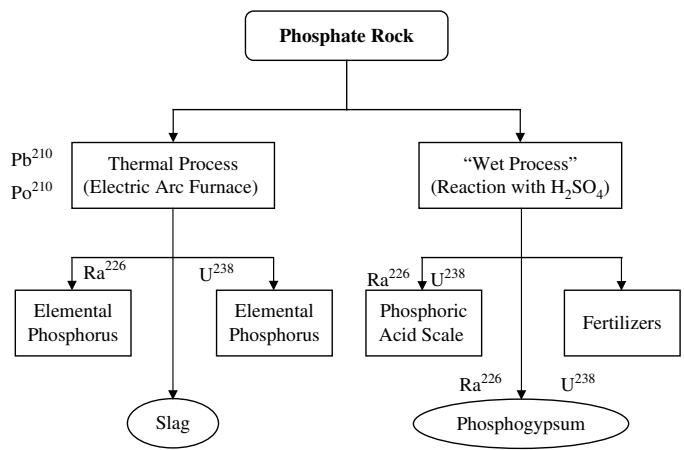
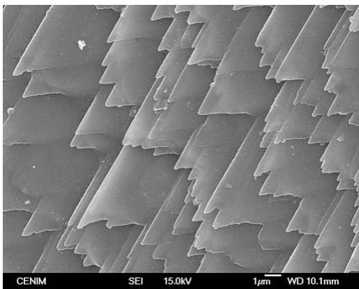
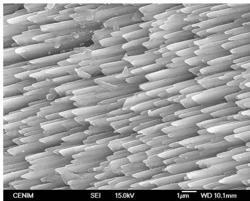

Review

# Environmental impact and management of phosphogypsum

Hanan Tayibi a, \*, Mohamed Choura b , Fe´ lix A. Lo´ pez a , Francisco J. Alguacil a , Aurora Lo´ pez-Delgado a

a National Centre for Metallurgical Research (CENIM), CSIC, Avda. Gregorio del Amo 8, E-28040 Madrid, Spain

b National Engineering School, Sfax University, Sfax, Tunisia

## a r t i c l e i n f o

Article history:   
Received 24 July 2008   
Received in revised form   
13 February 2009   
Accepted 7 March 2009   
Available online 29 April 2009

Keywords: Phosphogypsum Waste management Radioactivity Building material

## a b s t r a c t

The production of phosphoric acid from natural phosphate rock by the wet process gives rise to an industrial by-product called phosphogypsum (PG). About 5 tons of PG are generated per ton of phosphoric acid production, and worldwide PG generation is estimated to be around 100–280 Mt per year. This by-product is mostly disposed of without any treatment, usually by dumping in large stockpiles. These are generally located in coastal areas close to phosphoric acid plants, where they occupy large land areas and cause serious environmental damage. PG is mainly composed of gypsum but also contains a high level of impurities such as phosphates, fluorides and sulphates, naturally occurring radionuclides, heavy metals, and other trace elements. All of this adds up to a negative environmental impact and many restrictions on PG applications. Up to 15% of world PG production is used to make building materials, as a soil amendment and as a set controller in the manufacture of Portland cement; uses that have been banned in most countries. The USEPA has classified PG as a ‘‘Technologically Enhanced Naturally Occurring Radioactive Material’’ (TENORM).

- 2009 Elsevier Ltd. All rights reserved.

## 1. Introduction

Phosphogypsum (PG) is a waste by-product from the processing of phosphate rock by the ‘‘wet acid method’’ of fertiliser production, which currently accounts for over 90% of phosphoric acid production. World PG production is variously estimated to be around 100– 280 Mt per year (Yang et al., 2009; Parreira et al., 2003) and the main producers of phosphate rock and phosphate fertilisers are located in the USA, the former USSR, China, Africa and the Middle East. The phosphate industry is also an important contributor to national economies in many developing countries. The mineralogical composition of phosphate ore, as described by various researchers (Carbonell-Barrachina et al., 2002; Oliveira and Imbernon, 1998), is dominated by fluorapatite $[ \mathsf { C a } _ { 1 0 } \mathsf { F } _ { 2 } ( \mathsf { P O } _ { 4 } ) _ { 6 } { \cdot } \mathsf { C a C O } _ { 3 } ]$ goethite and quartz, with minor amounts of Al-phosphates, anatase, magnetite, monazite and barite. Heavy metals and trace elements such as cadmium (Cd) and nickel (Ni) are also detected.

Phosphate ores are naturally highly radioactive and their radioactivity originates mainly from 238U and 232Th.

In order to produce phosphoric acid, phosphate ore is processed either by dry thermal or wet acid methods. The dry thermal method produces element phosphorus using an electric arc furnace. The wet chemical phosphoric acid treatment process, or ‘‘wet process’’, is widely used to produce phosphoric acid and calcium sulphate – mainly in dihydrate form $\left( \mathrm { C a S O } _ { 4 } . 2 \mathrm { H } _ { 2 } \mathrm { O } \right) \left( \mathrm { E q . } \left( 1 \right) \right)$ A general scheme of the processes is shown in Fig. 1.

$$
\mathrm { C a _ { 5 } F ( P O _ { 4 } ) _ { 3 } + 5 H _ { 2 } S O _ { 4 } + 1 0 H _ { 2 } O }  \mathrm { 3 H _ { 3 } P O _ { 4 } + 5 C a S O _ { 4 } \cdot 2 H _ { 2 } O } + H F\tag{1}
$$

The wet process is economic but generates a large amount of PG (5 tons of PG per ton of phosphoric acid produced) (USEPA, 2002). The nature and characteristics of the resulting PG are strongly influenced by the phosphate ore composition and quality. PG is mainly $\mathrm { C a S O } _ { 4 } . 2 \mathrm { H } _ { 2 } 0$ but also contains impurities such as $\mathrm { H } _ { 3 } \mathrm { P O } _ { 4 } ,$ $C a ( H _ { 2 } P O _ { 4 } ) _ { 2 } . H _ { 2 } O , C a H P O _ { 4 } . 2 H _ { 2 } O$ and $\mathrm { C a } _ { 3 } ( \mathrm { P O } _ { 4 } ) _ { 2 }$ , residual acids, fluorides $( \mathrm { N a F , N a _ { 2 } S i F _ { 6 } , N a _ { 3 } A l F _ { 6 } , N a _ { 3 } F e F _ { 6 } a n d C a F _ { 2 } ) }$ , sulphate ions, trace metals (e.g. Cr, Cu, Zn and Cd), and organic matter as aliphatic compounds of carbonic acids, amines and ketones, adhered to the surface of the gypsum crystals (Rutherford et al., 1996).

  
Fig. 1. Scheme of the phosphate processes (USEPA, 1993).

Furthermore, wet processing causes the selective separation and concentration of naturally occurring radium (Ra), uranium (U) and thorium (Th): about 80% of 226Ra is concentrated in PG while nearly 86% of U and 70% of Th end up in the phosphoric acid. Determining the types of impurities present can be very important when defining waste management processes and environmental policies.

Only 15% of world PG production is recycled as building materials, agricultural fertilisers or soil stabilisation amendments and as set controller in the manufacture of Portland cement. The remaining 85% is disposed of without any treatment. This byproduct is usually dumped in large stockpiles exposed to weathering processes, occupying considerable land areas and causing serious environmental damage (chemical and radioactive contamination), particularly in coastal regions. The USEPA has classified PG as a ‘‘Technologically Enhanced Naturally Occurring Radioactive Material’’ (TENORM).

This paper reviews the different environmental impacts associated with PG storage and classifies the methods described in the literature for recycling and minimising the negative effects of this waste.

## 2. Characterisation of phosphogypsum

PG properties are dependent upon the nature of the phosphate ore used, the type of wet process employed, the plant operation efficiency, the disposal method, and the age, location and depth of the landfill or stack where the PG is dumped (Arman and Seals,

1990). PG is a powdery material that has little or no plasticity and is composed mainly of calcium sulphate dihydrate (>90% gypsum) and sodium fluorosilicate (Na2SiF6) (Berish, 1990; Kacimi et al., 2006). Due to the residual phosphoric, sulphuric and hydrofluoric acids contained within the porous $\mathsf { P G } ,$ it is considered an acidic byproduct (pH < 3). PG from filter cake usually has a free moisture content of 25–30%. The vertical hydraulic conductivity of PG has been reported to range between 1 -103 and 2 - 105 cm/s (SENES, 1987). The free water content may vary greatly, depending on how long the PG has been allowed to drain after stacking and on local weather conditions. PG solubility is dependent upon its pH, and it is highly soluble in saltwater (z4.1 g/l) (Guo et al., 2001). Its particle density ranges between 2.27 and 2.40 g/cm3 (SENES, 1987) and its bulk density between 0.9 and 1.7 g/cm3 (Vick, 1977; Keren and Shainberg, 1981; May and Sweeney, 1984).

From a morphological point of view, PG has a predominant particle size ranging between 0.250 and 0.045 mm in diameter (May and Sweeney, 1984), depending on the source of the phosphate rock and the reactor conditions (Becker, 1989). Milos and Dragan (2003), showed that PG has a marked crystal structure, mostly of rhombic and hexagonal forms. Similar results can be observed in the micrographs (Fig. 2) obtained in a morphological study of PG samples from Tunisia (Tayibi et al., 2008) using Scanning Electron Microscopy (Jeol Field Emission JSM6500F). The micrographs reveal a homogeneous and prismatic PG piling arrangement and a well-defined crystalline structure with a majority of rhombic and orthorhombic shaped crystals.

The chemical composition of PG from different sources is listed in Table 1 (Taha and Seals, 1992). According to this data the main components of the PG are CaO, sulphates (expressed as SO3), SiO2, Al2O3, Fe2O3, P2O5, and F. Table 2 shows the trace metal contents (arsenic, silver, barium, cadmium, chromium, lead, mercury and selenium) in (mg/kg) in some PG sources. These elements are on the Environmental Protection Agency (EPA) list of potentially toxic elements. One can see that the PG generally has a high total content of Ag, Au, Cd, Se, Sr, some light rare earth elements, and Y. PG from Central Florida has higher Sb and As contents than Alberta PG (Idaho), but a lower concentration of Ag, Ba, Cd and Sr. Meanwhile, Y, Zr, Cu, Ba and Ni levels are much higher in South African PG than in Central Florida PG. Tunisian PG has been reported to contain very high Cd, Hg and Zn levels (Rutherford et al., 1994; Choura, 2007).

With regard to radioactivity, as mentioned above PG contains relatively high levels of U-series radionuclides naturally present in the phosphate rock. Depending on the quality of the rock source, PG can contain as much as 60 times the levels normally found prior to processing. The most important source of PG radioactivity is reported to be 226Ra (Rutherford et al., 1994). The data presented in

  
Fig. 2. SEM images of PG at different magnifications.

Major element composition en (%) for different PG source.
<table><tr><td>Component</td><td>Reference</td><td>CaO</td><td>SiO2</td><td> $\mathsf { A l } _ { 2 } \mathsf { O } _ { 3 }$ </td><td> $\mathrm { F e } _ { 2 } \mathrm { O } _ { 3 }$ </td><td>Mgo</td><td> $S 0 _ { 3 }$ </td><td>Na20</td><td> $\mathrm { P } _ { 2 } 0 _ { 5 }$ </td><td>F</td></tr><tr><td>Algeria</td><td>Kacimi et al., 2006</td><td>31.18</td><td>0.88</td><td>0.10</td><td>0.03</td><td>0.06</td><td>40.90</td><td>1.32</td><td>0.87</td><td>1.20</td></tr><tr><td> Egypt</td><td>Taher, 2007</td><td>32.13</td><td>8.78</td><td>0.29</td><td>0.35</td><td>0.09</td><td>37.60</td><td>-</td><td>1.82</td><td>0.80</td></tr><tr><td>India</td><td>Manjit and Mridul, 2005</td><td>31.09</td><td>0.29</td><td>0.54</td><td></td><td>1.31</td><td>43.21</td><td>0.29</td><td>0.47</td><td>0.86</td></tr><tr><td>Turkey</td><td>Degirmenci et al., 2007</td><td>32.04</td><td>3.44</td><td>0.88</td><td>0.32</td><td>-</td><td>44.67</td><td>0.13</td><td>0.50</td><td>0.79</td></tr><tr><td>China</td><td>Weiguo et al., 2007</td><td>30.79</td><td>1.88</td><td>2.10</td><td>-</td><td>0.8</td><td>42.56</td><td>-</td><td></td><td></td></tr><tr><td>Morocco</td><td>Sebbahi et al., 1997</td><td>30.5</td><td>9.5</td><td>2.8</td><td>0.9</td><td>0.3</td><td>42.9</td><td>-</td><td>0.5</td><td>0.15</td></tr><tr><td>Tunisia</td><td>Rouis and Bensalah, 1990; Choura, 2007</td><td>31-32</td><td>-</td><td>0.1</td><td>0.1</td><td>0.4</td><td>46</td><td>0.3</td><td>1.2</td><td>1.2</td></tr><tr><td>USA</td><td>Taha and Seals, 1992</td><td>25-31</td><td>3-18</td><td>0.1-0.3</td><td>0.2</td><td>-</td><td>55-58</td><td>-</td><td>0.5-4.0</td><td></td></tr></table>

Table 3 shows that a wide variation of 226Ra activity concentrations has been observed (from 15 to 1140 Bq/kg for Sweden and Florida-USA, respectively), which can be attributed to the nature of the phosphate rock, the depth of sampling, and some 226Ra migration (Duen˜as et al., 2007). Some authors have also reported high $^ { 2 3 8 } \mathrm { U }$ and $^ { 2 1 0 } \mathrm { P o }$ activity. 226Ra produces radon gas $( ^ { 2 2 2 } \mathrm { R n } ) .$ , which has a short half-life of 3.8 days, an intense radiation capacity, and causes significant damage to internal organs (USEPA, 2002). For this reason the USEPA has classified PG as a ‘‘Technologically Enhanced Naturally Occurring Radioactive Material’’ (TENORM) (USEPA, 2002) and PG exceeding 370 Bq/kg of radioactivity has been banned from all uses by the EPA since 1992.

## 3. Environmental impact

PG management is one of the most serious problems currently faced by the phosphate industry. Only 15% of worldwide production is recycled, while 85% is stored in the vicinity of factories in coastal regions. The storage of PG without any prior treatment requires large land areas and can cause serious environmental contamination of soils, water and the atmosphere. Negative atmospheric impacts can be caused by the erosion of PG piles and the release of highly polluting substances, due to the presence of hazardous vapours containing heavy metals, sulphates, fluorosilicates, hydrogen fluorides (Szlauer et al., 1990) and phosphorus, cadmium and $^ { 2 \breve { 2 } 6 } \mathrm { { R a } }$ (Marovic and Sencar, 1995). Atmospheric agents can transport the contamination to neighbouring areas.

Content of some trace elements $( \mathrm { m g K g ^ { - 1 } } )$ in different PG source.
<table><tr><td>Element</td><td>Floridaa</td><td>Idahob</td><td>South Africac</td><td>Tunisiand</td></tr><tr><td>Ag</td><td>&lt;1</td><td>1-11</td><td></td><td></td></tr><tr><td>As</td><td>40</td><td>&lt;1-2</td><td></td><td></td></tr><tr><td>Au (μgKg-1)</td><td></td><td>3-15</td><td></td><td></td></tr><tr><td>B</td><td>3</td><td>&lt;10-30</td><td></td><td></td></tr><tr><td>Ba</td><td>7</td><td>20-140</td><td>140</td><td></td></tr><tr><td>Be</td><td>1</td><td>1-2</td><td></td><td></td></tr><tr><td>Br</td><td></td><td>1-2</td><td></td><td></td></tr><tr><td>Cd</td><td>7</td><td>9-28</td><td></td><td>40</td></tr><tr><td>Cl</td><td></td><td>&lt;100-300</td><td></td><td>0.025</td></tr><tr><td>Co</td><td>2</td><td>&lt;1-1</td><td></td><td>8</td></tr><tr><td>Cr</td><td></td><td>&lt;10-70</td><td></td><td>20</td></tr><tr><td>Cu</td><td>8</td><td>10-42</td><td>103</td><td>6-11.5</td></tr><tr><td>Hg (μg Kg-1)</td><td></td><td></td><td>&lt;50</td><td>14,000</td></tr><tr><td>Mn</td><td>15</td><td>&lt;2-10</td><td></td><td>6</td></tr><tr><td>Mo</td><td>16</td><td>&lt;1-2</td><td></td><td>5</td></tr><tr><td>Ni</td><td>2</td><td>3-15</td><td>13</td><td>15</td></tr><tr><td>Pb</td><td></td><td>3-7</td><td></td><td>5</td></tr><tr><td>Rb</td><td></td><td>&lt;10-20</td><td></td><td></td></tr><tr><td>Sb</td><td>100</td><td>0.30.8</td><td></td><td></td></tr><tr><td>Se</td><td></td><td>4-64</td><td></td><td></td></tr><tr><td>Sr</td><td>10</td><td>610-670</td><td></td><td>1100</td></tr><tr><td>Th</td><td></td><td>&lt;1-1</td><td></td><td>2</td></tr><tr><td>U</td><td></td><td>6-13</td><td></td><td></td></tr><tr><td>V</td><td>19</td><td>10-40</td><td></td><td></td></tr><tr><td>Y</td><td>2</td><td>100-120</td><td>50</td><td></td></tr><tr><td>Zn</td><td>9</td><td>18-112</td><td>6</td><td>315</td></tr><tr><td>Zr</td><td>10</td><td>&lt;10-110</td><td>185</td><td></td></tr></table>

a May and Sweeney, 1984.  
b Luther et al., 1993.  
c Malan, 1988.  
d Rouis and Bensalah, 1990 and Choura, 2007.

## 3.1. Atmospheric contamination

Several studies have discussed the impact of PG radionuclides. Bolivar et al. (2000), concluded that 90% of Po and Ra originally present in phosphate rock remain in PG, whereas the remaining U percentage is well below 20%. Thus the potential problem of PG piles is the emanation of 222Rn from the alpha-decay of $^ { 2 2 6 } \mathrm { R a } ,$ a radionuclide classified by the USEPA as a Group A human carcinogen, whose common presence in PG led to the regulation of PG disposal under the National Emission Standards for Hazardous Air Pollutants (NESHAP) and the National Emission Standards for Radon Emission from PG Stacks (Federal Register, 1999). The EPA ruling restricts PG exceeding 370 Bq/kg of 226Ra from being used on agricultural soil. The maximum regulatory limit of 222Rn exhalation (the flux density of ${ } ^ { 2 2 2 } \mathrm { R n }$ gas entering the atmosphere from the surface of a 226Ra-bearing material) established by the EPA (1998) is 0.74 Bq/m2 /s.

According to Mas et al. (2006), PG stacks located on salt marshes in Huelva (Spain) contain about 100 Mt of PG (area of approx. 1200 ha, with an average height of 5 m) and are generally not completely watertight or even covered with any inert material, leading to a local gamma radiation level between 5 and 38 times the normal rate (0.74 Bq/m2 /s). Measurements by CRIIRAD (Chayeyron, 2007) of the equivalent dose to one square metre of soil showed a result of 2–7 times the normal rate. In other words, 9 min exposure per day is equivalent to an accumulated dose of more than 10 mSv/year. This value is well above the recommended worldwide exposure limit of z2.4 mSv/year (UNSCEAR Report, 2000), and may thus pose a health threat to workers on the site or people living nearby (EURATOM Council Directive, 1996). In the same region, Duen˜as et al. (2007), made measurements $\phantom { + } \mathrm { o f } ^ { 2 2 2 } \mathrm { R n }$ exhalation over 24 h from active PG stacks and from restored and unrestored inactive PG stacks, correlating the results with various factors. The $^ { 2 2 2 } \mathrm { R n }$ exhalation of active PG stacks $( 0 . 5 2 3 \mathrm { B q } / \mathrm { m } ^ { 2 } / s )$ was two times higher than that of unrestored inactive stacks, while the ${ } ^ { 2 2 2 } \mathrm { R n }$ exhalation of restored PG stacks was eight times lower than that of active stacks. It should be noted that all the recorded values were lower than the aforementioned EPA limit value (EPA, 1998) and that the authors found a correlation between the exhalation value and the $^ { 2 2 6 } \mathrm { R a }$ activity concentration and soil porosity and density.

Radiochemical results of different types of PG samples analysed.
<table><tr><td>Radionuclides (Bq/Kg)</td><td>Reference</td><td>PG rock origin</td><td>238U</td><td> $^ { 2 2 6 } \mathrm { R a }$ </td><td> $^ { 2 1 0 } \mathrm { { P b } }$ </td><td> $^ { 2 1 0 } \mathrm { P o }$ </td><td>230Th</td></tr><tr><td>Spain</td><td>Borrego et al., 2007</td><td>Morocco</td><td>140</td><td>620</td><td></td><td>82</td><td>280</td></tr><tr><td>China</td><td>Burnett et al., 1996</td><td>Keiyan</td><td>15</td><td>85</td><td>82</td><td>82</td><td></td></tr><tr><td>Indonesia</td><td>Burnett et al., 1996</td><td>PT Petrokimia Gresik</td><td>43</td><td>473</td><td>480</td><td>450</td><td></td></tr><tr><td>India</td><td>Burnett et al., 1996</td><td>Vadorado</td><td>60</td><td>510</td><td>490</td><td>420</td><td></td></tr><tr><td>Egypt</td><td>Burnett et al., 1996</td><td>Nile Valley rock</td><td></td><td>100</td><td></td><td>445</td><td></td></tr><tr><td>Florida</td><td>Rutherford et al., 1994</td><td>Central Florida</td><td>130</td><td>1140</td><td>1370</td><td>1030</td><td>113</td></tr><tr><td>Australia</td><td>Rutherford et al., 1994</td><td>Numerous</td><td>10</td><td>500</td><td></td><td></td><td></td></tr><tr><td>Sweden</td><td>Rutherford et al., 1994</td><td>Kola (USSR)</td><td>390</td><td>15</td><td></td><td></td><td></td></tr></table>

Lysandrou et al. (2007), measured the $^ { 2 2 2 } \mathrm { R n }$ emanation rate of PG samples dumped in a coastal area of Cyprus, placing them in a sealed plastic container and monitoring radon activity growth as a function of time for about 80 h. The 222Rn emanation rate ranged from 0.35 to 1.1 Bq/h, which is higher than the geological background radon emanation rate in Cyprus. This could cause an increase in radon levels and thereby generate excessive radiation exposure for humans, in extreme cases reaching values of up to 17 mSv/year.

In Korea PG is generally used to manufacture boards for house construction, thus exposing indoor occupants to a potential radiological impact. Jang et al. (2005), estimated the $^ { 2 \bar { 2 } 2 } \mathrm { R n }$ emanation from PG boards and presented a mathematical model of the emanation rate considering the back diffusion effect due to the accumulation of $^ { \cdot 2 2 2 } \mathrm { R n }$ -laden air. Two types of PG board of different thicknesses and Ra contents were considered: PG1 (2.2 cm and 259 Bq/kg) and PG2 (3.7 cm and 289 Bq/kg). Measurements were made for times of up to 133 h and 144 h. The experimental ${ } ^ { 2 2 2 } \mathrm { R n }$ emanation for PG1 was 78.07 Bq/m3 and the calculated value was 77.7 Bq/m3 . With regard to PG2, the experimental 222Rn emanation was $1 3 6 . 1 6 ~ \mathrm { B q } / \mathrm { m } ^ { 3 }$ and the calculated value was 139.12 Bq/m3 .

## 3.2. Water and soil contaminations

Another matter of concern is the leachability of hazardous elements from PG and thus the contamination of groundwater underlying PG stacks (May and Sweeney, 1982, 1983; Carter and Scheiner, 1992; Berish, 1990). Since PG waste is generally transported and disposed as an aqueous slurry, PG piles can be affected by tidal variations and dissolution/leaching of the elements naturally present in the PG can occur. Dissolved elements may be deposited in nearby soils or transferred to waters and finally to living beings (Reijnders, 2007). The international limit prescribed by the European Atomic Commission (EURATOM) is 500 Bq/kg (Sunil, 2002; EURATOM Council Directive, 1996). 226Ra leachability from PG stockpiles has been evaluated by several researchers.

Haridasan et al. (2002), conducted leaching studies on PG samples from Kochi, India, using distilled water $( \mathsf { p H } = 6 . 0 )$ and rainwater $( \mathrm { p H } = 5 . 0 - 5 . 8 )$ as leachants in different contact time and solid/liquid ratio conditions. The laboratory results indicated that rainwater leached less $^ { 2 2 6 } \mathrm { R a }$ (0.09–0.28 Bq/l) than distilled water (0.08–0.38 Bq/l). When PG was exposed to natural weather conditions (rain) the maximum $^ { 2 2 6 } \mathrm { R a }$ activity in the leachate was 0.53 Bq/l while the minimum was 0.07 Bq/l. Most $^ { 2 2 6 } \mathrm { R a }$ values determined in the leachates exceeded the limit value of 0.1 Bq/l prescribed by the Bureau of Indian Drinking Water Standards.

Azouazi et al. (2001), investigated $^ { 2 2 6 } \mathrm { R a }$ solubility from Moroccan PG in aqueous solution. The initial $^ { 2 2 6 } \mathrm { R a }$ activity in phosphate rocks and PG was found to be around 1700 and 1420 Bq/ kg, respectively. The leaching study involved mixing 20 g of PG with

50 ml of distilled water for 20 h at various pH values (2.10–8.84). The results showed an average $^ { 2 2 6 } \mathrm { R a }$ leaching rate of 26.4%, which could be cut to 6% when the leached PG was previously calcined at $8 0 0 ^ { \circ } \mathsf C$ When the calcined PG was leached with acidified aqueous solutions, HCl (4 N) or $\mathrm { H } _ { 3 } \mathrm { P O } _ { 4 } ( 2 2 . 1 ~ \mathrm { N } ) ,$ , no $^ { 2 2 6 } \mathrm { R a }$ was detected. The analysis of a water sample from an area close to the phosphate mine revealed the presence of $0 . 2 \mathrm { ~ B q } / \mathrm { l }$ of $^ { 2 2 6 } \mathrm { R a }$ , which is below the radium chemical safety limit for water (1 Bq/l).

Burnett and Elzerman (2001), evaluated the migration of radionuclides from Florida PG stacks. Sampling was carried out through monitor wells in the surface aquifer close to PG stacks and in older PG piles. It was deduced that the stack solutions were characterised by a very low pH of $2 . 4 3 \pm 0 . 1 0 , \mathrm { a }$ high ionic strength, and a high total dissolved solids content $( \sim 1 8 , 7 0 0 \ : \mu \mathrm { g / k g } )$ , while the aquifer water around the stacks had a lower average total dissolved solids content (around $3 3 0 0 \mu \mathrm { g / k g ) }$ and a pH value of $6 . 3 3 \pm 0 . 6 5 ,$ comparable to the normal groundwater value in the area. From a radiochemical point of view the stack solutions were more enriched in 238U (10–17 Bq/l), 222Rn (300–1200 Bq/l) and $^ { 2 1 0 } { \mathrm { P b } } ( 7 -$ 70 Bq/l) than the aquifer water. With regard to $^ { 2 \hat { 2 } 6 } \mathrm { \check { R } a } ,$ the specific activity in the stack fluid was low $( 0 . 1 - 0 . 2 \ B \mathbf { q } / 1 )$ but slightly higher than normal groundwater values. Furthermore, most of the stack solutions displayed lower $^ { 2 2 6 } \mathrm { R a }$ activity than the majority of the measurements made around the PG stacks, which in no case exceeded the USEPA 226Ra in drinking water standard value $( \sim 0 . 2 \ : \mathrm { B q / l ) }$ (USEPA, 2000). However, in the case of U activity the ‘‘gross alpha’’ standard $( \sim 0 . 6 \ : \mathrm { B q / l ) }$ was exceeded. On the other hand, modelling of the environmental radio-chemistry of U, Pb and Ra showed that within the stacks these radionuclides were mainly in the form of complexes with sulphate and phosphate, which are relatively mobile uncharged or negatively charged solution species. However, as the pH below the stack increased, the precipitation of multi-component solid phases prevented the large-scale migration of these radionuclides to the underlying aquifer.

The results of studies carried out by Bolivar et al. (2000), on the aquatic environment of the estuary formed by the rivers Tinto and Odiel (Huelva, Spain) indicated the presence of severe contamination by U-series radionuclides contained in PG stacks located close to the estuary’s tidal prism. The average $^ { 2 1 0 } \mathrm { P o }$ concentration detected was 10  3 mBq/l, which greatly exceeds the normal values found in uncontaminated estuarine waters (2 mBq/l). The average 238U contents were 43  7 mBq/l and $3 8 \pm 3$ mBq/l in low and high tides, respectively, quite similar to the value of 40 mBq/l obtained in uncontaminated sea water. Pe´rez-Lo´ pez et al. (2007), evaluated the mobility of metals from phosphate rock to PG and later to the estuary. Their results showed that in general the studied metals were efficiently transferred from the phosphate rock to the PG waste as a mobile fraction, with an average transfer factor of $14 0 \pm 2 2 \%$ . The total mobile content of Cu and Ni from the phosphate rock and the U and Ni content from PG waste end up in the bioavailable fraction. Furthermore, due to the exposure of PG to weathering conditions, the effluents resulting from leaching of this waste may also present a high concentration of these metals. Taking into account the total mass of PG (100 Mt), the water-soluble metals released into the estuary were estimated to be: Ba (6509 t), Zn (6726 t), Ni (232 t), Cu (1158 t), Cd (667 t) and Sr (54,219 t). This means serious contamination, which can be extended a long way around the coast by tide and wave action.

The leachability of Cd, Cu, U and Zn in Syrian PG was studied by Al-Masri et al. (2004). Continuous and batch leaching experiments using distilled water and dilute H2SO4 (0.1–1 mol/l) and sequential leaching with distilled water and various selective extractants were performed. The test samples were from 11 combined PG samples, previously dried at $8 0 ^ { \circ } \mathrm { C }$ for 24 h, sieved (555 mm sieve) and homogenised. The prepared sample was then fractionated into 6 different particle sizes (45–555 mm) in order to determine as well the effect of particle size on PG leachability. In the case of continuous leaching for 60 min, the amount of Cu, Zn and Cd dissolved in distilled water exceeded 50%, while only 20% of U was dissolved. The leachate resulting from batch leaching experiments using distilled water (varying the stirring time between 10 and 120 min) showed that Zn, Cu, Cd and U were the most easily transferred elements in the aqueous phase, with transfer percentages of 97, 68, 57 and 31%. With regard to the sequential leaching of PG with concentrated acids, the results showed that trace elements were dissolved in the following order: U (31%), Cd (25%), Zn (10%), and Cu (10%). Increasing the $\mathrm { H } _ { 2 } \mathrm { S O } _ { 4 }$ concentration resulted in an enhancement of U, Cd, Zn and Cu solubility. With regard to the effect of particle size, fine particles (45–75 mm) yielded a relatively high solubility.

Lysandrou and Pashalidis (2008), studied the potential impact of the solution composition (e.g. acidity and salinity) on U leachability from PG stacks using de-ionised water and seawater. Samples were taken from three areas with different acidity, salt contents and PG ages. A1 and A2 were from aged and fresh PG respectively, while A3 was characterised by its high salinity originated by seawater. The U concentration in the PG stacks was found to be 75, 30 and 40 Bq/kg in A1, A2 and A3, respectively. The U concentration in the stack solutions was 2, 81 and 282 mg/l, respectively. Furthermore, the solubility of $\mathsf { P G } ,$ particularly in terms of Ca and U leachability, was enhanced by up to three orders of magnitude by increasing the salinity, as a consequence of the effect of ionic strength on PG solubility. Therefore a high U content was found in PG from A1 (75 Bq/kg), compared to 40 Bq/kg in PG from A3, where U is leached by the seawater and consequently caused an important migration of U to the adjacent sea.

## 4. Phosphogypsum treatment for different applications

In view of the aforementioned characteristics of PG (more than 95% is $\mathrm { C a S O } _ { 4 } . 2 \mathrm { H } _ { 2 } 0 )$ and its attractive economic potential, and of continuously increasing concerns about environmental pollution as well, nowadays there is a great interest in using PG as an alternative raw material for many applications. PG has been used in the cement industry as a setting regulator in place of natural gypsum (Akın and Yesim, 2004) and in the gypsum industry to make gypsum plaster. PG also has been used as an agricultural fertiliser or for soil stabilisation amendments (Papastefanou et al., 2006; Degirmenci et al., 2007; Reijnders, 2007), and as a fly ash–lime reaction activator with wide application in the manufacturing of building materials (Weiguo et al., 2007). The total use of PG in building materials is probably well below 15% of the world PG production (Kelly et al., 2002). In the United States this use was banned in 1990 (Federal Register, 1990) and in the European Union it was discontinued in 1992. The presence of impurities has given rise to many restrictions on the potential applications of PG. Studies have shown that phosphates and fluorides delay the setting time and reduce the early strength development of cement, and has been found that a relatively high level of ${ \mathsf { A L F } } ^ { 5 ^ { - } }$ negatively affects several aspects of gypsum crystal formation (Koopman, 2001). Thus, processes based on washing, drying, and chemical and thermal extraction have been recommended by numerous researchers to make use of PG.

The PG treatment methods described in the literature can be classified as follows:

## 4.1. Methods involving chemical or physical treatment

In order to render PG harmless and suitable for later applications, researchers have proposed methods such as washing, wet sieving, neutralisation with lime, and treatment with a mixture of sulphuric acid and silica or hot aqueous ammonium sulphate solutions.

Manjit et al. (1993) tested an aqueous ammonium hydroxide solution (5–20%) to reduce phosphate and fluoride contents in PG before its use in the cement industry. Each sample was shaken with different ammonium hydroxide concentrations (for 24 h at $3 5 ^ { \circ } C )$ then filtered, washed firstly with 0.5% ammonium hydroxide solution and then with water, and finally dried at $4 2 ^ { \circ } \mathsf C$ . The method achieved a decrease in all types of impurities. In a follow-up work, Manjit (2002) shook PG samples with 2–5% aqueous citric acid solution instead of ammonium hydroxide solution for 15–25 min at $3 0 ^ { \circ } \mathsf C .$ The impurities were removed as water-soluble compounds: $\mathrm { H } _ { 3 } \mathrm { P O } _ { 4 } , \mathrm { N a } _ { 3 } ( \mathrm { C } _ { 6 } \mathrm { H } _ { 5 } \mathrm { O } _ { 7 } ) _ { 2 } ,$ , HF, $\mathrm { H } _ { 3 } \mathrm { S i F } _ { 6 } ,$ H $\mathrm { I } _ { 3 } \mathrm { A l F } _ { 6 }$ and $\mathrm { H } _ { 3 } \mathrm { F e F } _ { 6 } .$ . The optimum aqueous citric acid solution concentration was 3–4%.

In further research by Manjit et al. (1996) another purification process based on wet sieving and hydrocyclone trials was investigated. In the first case, the PG sample was wet sieved through a 300 mm sieve, washed and dried at 42 C. The results showed that impurity concentrations were lower in the fine fraction that passed through the sieve (85%) than in the coarse fraction retained in sieving (15%), dropping from 1.28 to 0.41% for $\mathrm { P } _ { 2 } { \bf O } _ { 5 } ,$ from 1.80 to 0.57% for fluorides, and from 1.58 to 0.34% for organic matter. In the case of hydrocyclone purification treatment, PG was mixed with water (in a proportion of 1:3 by volume) for 30, 50 and 65 min in order to solubilise the impurities. Underflow (collected at the bottom of the hydrocyclone) and overflow samples were collected from the PG slurry and dried at $4 2 ^ { \circ } \mathsf C .$ Comparatively to the overflow samples, the underflow samples were characterised by high pH values (5.8–6.0), a high $S 0 _ { 3 }$ content, and a lower level of $\mathrm { P } _ { 2 } { \bf O } _ { 5 } ,$ fluorides, organic matter and alkalis. These results are similar to those obtained with wet sieving treatment.

The PG purification process employed by Al-Jabbari et al. (1988), consists of washing PG with water, sieving it through a 100 mm sieve, and calcining it at different temperatures (low and high). In order to improve the setting time and the compressive strength of the resulting material, accelerators (such as calcium hydroxide) were added to the calcined PG. The purified PG was chemically analysed and physically tested. The results indicated that the best and cheapest method of purifying PG was by washing with water, sieving through a 100 mm sieve, and then neutralising with calcium hydroxide.

Potgieter et al. (2003), studied the effect of chemical and physical treatments of PG incorporated in clinker to obtain cement with a $S 0 _ { 3 }$ content of 2.3%. Two PG samples (one dried directly at $5 0 ^ { \circ } \mathsf C$ and the other washed with water for 10 min and then dried at the same temperature) were subjected to different treatments using acidic and basic additions (HCl, $\mathrm { H } _ { 2 } \mathrm { S O } _ { 4 }$ and $\mathrm { N H } _ { 4 } \mathrm { O H } )$ during the washing stage. The resulting PG was washed and dried at $4 5 ^ { \circ } \mathsf C$ and then interground with clinker. Reference samples were prepared with natural gypsum. The results showed that except for the PG treated with HCl, the initial and final setting times were shorter for cement with unwashed PG than with washed PG. The best setting time reduction was obtained with sulphuric acid treatment (165 and 210 min for the initial and final set, respectively). With regard to mechanical strength, the unwashed PG achieved a slightly lower strength than the washed PG, although the difference between the various treatments was not significant. Moreover, it seems that all of the treatments resulted in an increase in the final strength of the cement. On the other hand, the physical treatments involved the milling of different amounts of slaked and unslaked lime (between 1 and 2%) with PG for 15 and 30 min before being slurried in tap water and subjected to ultrasonic vibration for 15–30 min. The resulting treated PG was then mixed with the clinker to obtain cement. The results showed that compared with natural gypsum reference, the incorporation of unslaked lime in the cement provided an increase in the setting times and decreased the mechanical strength (except in the case of 1% unslaked lime). Slaked lime had the reverse effect on cement behaviour, improving its mechanical strength and providing acceptable setting times for cement applications. In this case the best results were obtained by adding 1.25% of slaked lime. The results obtained with ultrasonically treated PG were similar to those obtained with slaked lime, and the short ultrasonic treatment time of 15 min was the most appropriate.

Olmez and Erdem (1989), studied the removal of impurities using several methods based on the neutralisation of water-soluble impurities in PG with water and lime milk, the removal of $\mathrm { P } _ { 2 } 0 _ { 5 }$ substituted in the gypsum crystal lattice, and a calcining process. The purified PG was mixed with Portland cement instead of natural gypsum and the prepared specimens were kept for 28 days at $2 0 ^ { \circ } \mathsf C .$ The treatment of PG samples by washing with tap water once and twice at $2 0 ^ { \circ } \mathsf C$ removed most water-soluble impurities, reducing the amount of $\mathrm { P } _ { 2 } \mathrm { O } _ { 5 }$ from 1.02% to 0.84% and fluoride from 0.79% to 0.61%. However this treatment cannot effectively reduce the final retarding action of the tested cement paste. The best results were obtained when PG was washed with lime milk, due to the inactivation of the all water-soluble impurities. The setting time of cement pastes prepared with PG, heated at $1 4 0 ^ { \circ } \mathsf C$ and $1 5 0 ^ { \circ } \mathrm { C }$ for 30 min and then washed with lime milk were similar to the control samples. For the same purpose, in another study Olmez and Yilmaz (1988), washed PG in water or lime milk and then exposed it to thermal treatments at $1 4 0 { - } 1 5 0 ^ { \circ } \mathrm { C }$ for 30 min and at $1 3 0 { - } 1 5 0 ^ { \circ } \mathrm { C }$ for 60 min to improve its chemical and physical properties. The results showed that all water-soluble impurities can be removed by simple washing treatment with water or lime milk, but the $\mathrm { P } _ { 2 } { \bf O } _ { 5 } ,$ substituted in the PG crystal lattice, and other impurities cannot be removed by the washing process and require thermal treatment.

To reduce the levels of metal salts, phosphates and radioactive compounds, Kovler and Somin (2004), focused their work on the use of a topochemical reaction with an unspecified agent, solubilising phosphates and radioactive and other metal salts at temperatures between 140 and $3 5 0 ^ { \circ } \mathsf C .$ They claimed that the $^ { 2 \dot { 2 } 6 } \mathrm { R a }$ content of PG can be decreased by a factor of 20–50% and the $\mathrm { P } _ { 2 } 0 _ { 5 }$ content by a factor of 16–28%.

## 4.2. Methods including thermal treatments

The heat treatment of PG has been considered by several authors and heat treated PG has been found to have fewer impurities than the untreated material. Furthermore, the results show that the heat treatment of PG not only allows the inertisation of impurities but also the production of anhydrite which has a wide application in the manufacturing of building materials and cement industry.

## 4.2.1. Construction and building applications

Different authors have proposed different temperatures to produce anhydrite. Manjit and Mridul (2000), developed the production of stable, high strength anhydrite cement according to USA Standards. PG was exposed to 500, 600, 700, 800, 900 and $1 0 0 0 ^ { \circ } \mathrm { C }$ for 4 h, and after cooling, the different anhydrites obtained were grounded in a ball mill. X-ray diffraction and scanning electron microscopy studies indicated that the optimum temperature to produce a stable anhydrite from PG waste was $1 0 0 0 ^ { \circ } { \mathsf { C } } .$ Moreover, data showed that anhydrite cement produced from PG has lower energy requirements than other traditional building materials. The results of addition of several types of chemical activators, such as sodium sulphate, ferrous sulphate, ammonium sulphate, potassium sulphate, potassium dichromate, calcium chloride and calcium hydroxide, showed that compressive strength improved in all cases with curing time and mainly exceeded the USA Standard limit value of 17 MPa at 28 days. The maximum compressive strength (38.90 MPa) was obtained with the use of a mixture of ${ \tt N a } _ { 2 } { \sf S O } _ { 4 }$ and $\mathsf { F e S O 4 }$ as activator (Zielinski and Cyrkiewicz, 1994). In 2005, Manjit and Mridul explained in further work based on the results of the above study, how the anhydrite plaster produced by heating PG at $1 0 0 0 ^ { \circ } \mathrm { C }$ for 4–5 h can be used to manufacture flooring tiles by mixing with catalysed monomers, glass fibre, pigments, fly ash/red mud, etc. The anhydride was previously finely ground and sieved through a 75 mm IS sieve and then mixed with sulphates, chlorides and hydroxides of alkali and alkaline earth materials to promote quick setting. The floor tiles obtained using the anhydrite plaster were characterised by a flexural and compressive strength of 11–15 and $3 0 { - } 4 0 \ \mathrm { N / m m } ^ { \bar { 2 } } ,$ respectively. The water absorption value was found to be between 2.0 and 3.5% and the wear resistance between 2.0 and 4.0 mm. All these values were conforming to Indian Standards.

Mridul et al. (1996), reported that a cementitious binder made with calcined PG (hemihydrate), fly ash and hydrated lime in proportions of 40, 40 and 20% respectively, and cured for 28 days at $5 0 ^ { \circ } \mathsf C$ can have different applications as a building material. In contrast, the binder materials cured at $2 7 ^ { \circ } \mathsf C$ exhibited higher strength, better water resistance and low porosity, which is attributed especially to the high amount of hydration products such as ettringite and tobermorite. The durability test involved various cycles of alternate wetting and drying on the one hand, and heating and cooling on the other hand by increasing the temperature from $2 7 \ { \mathrm { t o } } \ 6 0 ^ { \circ } { \mathrm C } .$ When the cementitious material was cured at $5 0 ^ { \circ } \mathrm { C } ,$ contrarily to those cured at $2 7 ^ { \circ } \mathsf C$ , a lower fall in strength and weight loss was observed with the alternate wetting and drying cycles. Moreover, in the case of alternate heating and cooling cycles no strength variation or weight loss was noted.

On the other hand, studies have been focused on the development of several applications of PG with cement, fly ash and lime in the construction industry. Min et al. (2008), studied the potential of using calcined PG as an activator of fly ash–lime binders to increase early strength. PG used was heated at $1 3 5 ^ { \circ } \mathsf C$ for 3 h and then crushed in a roller mill for 8 min before being incorporated in different proportions (0, 5, 8, 10, 12 and 15% by weight) to the fly ash and lime mixture. The specimens obtained were cured in two conditions: some at room temperature and the others firstly at $4 5 ^ { \circ } \mathsf C$ and 90% humidity for 12 h and then at room temperature. The study showed that the specimens showed different behaviour according to their curing conditions. In the case of the specimens cured at room temperature, compressive strength was significantly improved by the incorporation of 8% calcined PG. Also, for the same fly ash content (75%) and an increasing PG content, the early strength (1, 3 and 7 days) improved, while the late strength (after 7 days) decreased. The strengths at different ages of samples cured first at $4 5 ^ { \circ } \mathsf C$ in 90% humidity were considerably improved. The mineralogical study of the specimens with calcined PG confirmed the formation of ettringite and gypsum, which accelerated the pozzolanic reaction of fly ash and consequently greatly enhanced the mechanical strength.

Sunil (2003), performed a perspective research on calcined PG– fly ash–lime hollow blocks as an alternative to conventional wall bricks. The procedure involved firstly mixing calcined PG and fly ash in different weight proportions and then incorporating the hydrated lime slurry to the mix. The study showed that the compressive strength of the hollow blocks increased by extending the curing time from 24 to 120 days. For a specific proportion of PG (20–30%), the compressive strength improved when increasing the amount of fly ash, reaching a maximum value at a fly ash content of 35–40%. Also, for the same proportion of fly ash, when the PG content was reduced from 30 to 20% the hollow blocks exhibited lower strength. Concerning the durability of PG –fly ash–lime hollow blocks in sulphate environments, it was reported that they have sufficient strength for use as a construction material.

In research work carried out by Degirmenci (2008a), cementitious binder specimens were composed of different percentages of PG and fly ash and 10% of hydrated lime. Two types of PG were used: PG calcined at 150 C for 2 h, and PG air-dried and then sieved through a 4.75 mm sieve (raw PG). The obtained specimens were cured in two different conditions: water and air at $2 0 ^ { \circ } C$ for 28 days. It was found that in both curing conditions an increase in the raw PG percentage caused a reduction in compressive strength down to the lowest value of 2.29 MPa for 50% raw PG. In contrast, the addition of calcined PG improved compressive strength, with a maximum value of 13.76 MPa obtained for 50% calcined PG for both curing conditions. However, it was observed that in general the specimens cured in water showed lower strengths than those cured in air, with a pronounced effect in the case of raw PG. On the other hand, the increase in PG content caused an increase in water absorption; although the raw PG specimens showed higher values (28–40%) than the calcined PG specimens (10–23%). Furthermore, the specimens made of raw PG and cured in water exhibited considerable expansion and crack formation, while negligible expansion was observed when the specimens were cured in air. Therefore, the calcined PG showed better mechanical behaviour, lower water absorption and a lower unit weight, making it suitable for building applications. Degirmenci (2008b) tested the stabilisation of adobe material, characterised by poor mechanical properties and low resistance to moisture and water attack, with PG and natural gypsum (NG) for building applications. The increasing PG and NG rates (0, 5, 10, 15, 20 and 25%) applied to the adobe soil resulted in a significant enhancement of compressive strength at 28 days from 1.01 MPa for untreated adobe soil (0% PG) to a maximum value of 4.34 MPa for 25% PG. All the strength values obtained were considerably greater than the limit values required by standards. Moreover, development of the adobe soil water resistance and sample unit weight and the reduction of drying shrinkage were found to be associated with increasing PG and NG contents.

Weiguo et al. (2007), studied the effect of incorporating PG in a new type of lime–PG–fly ash binder for a road base material application to replace a lime–fly ash binder characterised by low early strength. The results showed that PG has a more pronounced binder action than lime and promotes a rapid reaction between lime and fly ash. Therefore, lime–PG–fly ash binders reached higher strengths than those manufactured with only lime–fly ash. Compared to the mechanical behaviour of some other road base materials such as cement soil, cement–lime soil, lime–fly ash soil, etc., the lime–PG–fly ash binder showed the highest values for all ages. These results were corroborated by the microscopy study which, in the case of lime–PG–fly ash, confirmed the presence of large amounts of needle like crystals (hydration products) surrounding the fly ash particles and therefore enhancing the joins between the different particles in the binder. No significant hydration products were observed in the case of the lime–fly ash binder.

Guo et al. (2001), produced PG-Class C fly ash-Portland type II cement composites for a marine application using dried PG. The samples were cured at room temperature and 100% humidity for 2 weeks. The samples were then exposed to a tidal current in a marine environment at a temperature of $1 6 { - } 3 1 ^ { \circ } C ,$ salinity of 15– $2 6 \text{‰}$ and pH of 7.8–8.5. Other composites were subjected to a dynamic leaching test with saltwater. In contrast to the control samples, a stronger calcium carbonate coating embedded with fly ash particles was identified in both the immersed and leached samples. This layer was found to be a product of chemical interactions between the composites and the saltwater and resulting from the precipitation of calcite on the block surface, encapsulating the composites and increasing their survivability by covering the more sulphate resistant surfaces. The results in this research indicated that the 62%–35%–03% PG-Class C Fly ash-Portland type II cement composite survived in saltwater for more than two years. It was further concluded that the effective diffusion coefficient is a good indicator for the long-term survivability of stabilised PG-Class C Fly ash-Portland type II cement composites. In contrast, the reverse result was obtained when Kelly et al. (2002), investigated the resistance in marine environments of composites made with dried and sieved PG (passed through a 2 mm sieve), class C fly ash and dried lime instead of Portland type II cement. The results obtained differ completely from those of the above research, although the composite manufacturing conditions were very similar. The composites immersed in saltwater exhibited surface ruptures from the first 3 weeks, allowing the intrusion of saltwater and consequently an increase in PG dissolution and then the formation of additional ettringite by multiple reactions between the sulphate ions (from PG) and calcium aluminium oxides (from C fly ash), causing an erosion of the boundaries and severe degradation. The percent diameter expansion ranged from 2.3 to 17%, which exceeded the selected threshold and also the maximum percent diametrical expansion of 1.8% determined when Portland type II cement was used. The high active lime content (>3%) had a negative effect on the composite behaviour, increasing their percent diametrical expansion, promoting ruptures and neutralising the benefit of any CaCO3. Therefore, the survivability potential of the PG composites in the marine environment was negatively affected because of the high development rate of ruptures throughout the composites. And even if the calcium carbonate coating was formed on their surfaces, it could not protect them from saltwater intrusion. The PG-Class C Fly ash-lime composites survived for only 15 weeks in marine conditions, while the PG-Class C Fly ash-Portland type II cement composites survived for 2 years.

## 4.2.2. Cement industry applications

Other researchers have tested the effect of PG as a mineralizer on the burning temperature of clinker and as a set controller in Portland cement as well as its effect on cement properties and its effect on cement setting and mechanical properties.

Mehta and Brady (1977) proposed to reduce the temperature of clinker formation by adding and mixing the PG with the raw mix before clinkering. Four types of cement were made: on one hand, intergrinding PG and reagent gypsum with the raw mix to obtain a clinker with $2 \% S O _ { 3 }$ content, which was burning at $1 2 8 5 ^ { \circ } \mathrm { C }$ for 1 h and then cooling by air. On the other hand, by grinding PG and the reagent gypsum (control sample) added directly to the clinker. The data indicated that cement prepared with the PG which was mixed with the raw mix before clinkering required the lowest time of milling (55 min), while the ones made by incorporating PG directly to the clinker required 90 min. This confirmed the negative effect of the impurities on the grinding process. PG also used as mineralizer, decreased the retarding effect from 155 min for the control sample to 75 min and increased more than twice the early strength for 1 day from 8.1 MPa (control sample) up to 17.3 MPa, whereas after 28 days, the strength increase was only 8%. Moreover, the cement made by incorporating PG before clinkering and in comparison with that made by adding PG directly to cement plant clinker allowed a very efficient energy savings by reducing heat energy required for the clinkering process as well as decreasing the power consumed for the grinding operation. The positive effect of the PG on the formation of clinker minerals by decreasing the thermal energy consumption was also confirmed by Mehta (1979). He reported that the addition of 5% of calcined PG at 900 C to 90% Portland cement in the presence of 5% silica fume improves the hydraulic properties of cement as well as its mechanical properties for up to 90 days. Valenti (1987), demonstrated the fluxing and mineralising properties of PG by analysing the behaviour of mixtures of $\mathsf { C a C O } _ { 3 } , \mathsf { A l } _ { 2 } \mathsf { O } _ { 3 }$ and $\mathrm { C a S O } _ { 4 } . 2 \mathrm { H } _ { 2 } 0$ (from PG and pure gypsum) in stoichiometric ratio to synthesise 3CaO. $3 { \tt A l } _ { 2 } 0 _ { 3 } . { \tt C a S O } _ { 4 }$ at temperatures ranging from 950 to $1 3 5 0 ^ { \circ } \mathrm { C }$ and for times between 30 min and 10 h. It was found that the addition of PG to the mixtures made it possible to decrease the unconverted lime content and consequently the completed synthesis at a low burning temperature, between 1050 and $1 1 0 0 ^ { \circ } \mathrm { C }$ within only 30 min. However, the temperatures and times required by mixtures with pure gypsum to complete the synthesis process were significantly higher $( 1 3 5 0 ^ { \circ } \mathsf C$ and 3 h) than those of PG.

The effectiveness of PG valorisation as a mineralizer in the production of clinker Portland cement by improving the technological parameters of the clinker has been established by Kacimi et al. (2006). Different PG percentages between 0 and 10% were mixed with the raw material and heated for 30 min at a heating rate of $3 0 ^ { \circ } \mathrm { C } _ { I }$ min up to $1 4 5 0 ^ { \circ } \mathrm { C }$ to produce clinker. The incorporation of PG resulted in an increase in the initial limestone decarbonation temperature from $7 5 0 ^ { \circ } \mathrm { C }$ for the clinker raw material without PG to $9 0 0 ^ { \circ } \mathsf C .$ Furthermore, at this temperature it was observed that PG had a mineralising effect on the decarbonation process, since the mixtures containing a higher PG content presented a higher amount of free lime. At $9 5 0 ^ { \circ } \mathsf C ,$ an adverse effect was observed due to the catalytic effect of PG which accelerates the lime combination process and the free lime content was more significant in the mixture with a lower PG content. When the heat temperature reached $1 0 0 0 ^ { \circ } { \mathsf { C } } _ { \mathsf { \Omega } }$ , the mixtures containing a higher amount of PG showed the lowest free lime proportion, demonstrating that decarbonation was completed. At low temperature $( 1 1 5 0 ^ { \circ } \mathrm { C } ) ,$ alite was formed and its content was associated with the amount of PG. However, the clinker formation temperature decreased in relation to the PG content. Therefore, PG-clinker with 10% PG contained a higher alite percentage (56%) and a negligible free lime content (0.4%), in spite of the low burning temperature of $1 2 0 0 ^ { \circ } \mathsf C$ , while the ordinary clinker (control sample) contained 52% alite at $1 4 7 0 ^ { \circ } \mathrm { C }$ . In comparison with ordinary clinker, the PG-clinker was characterised by a high $S 0 _ { 3 }$ content and the presence of small crystals and a low amorphous phase. The grinding time was decreased from 26 min for the ordinary clinker to 19 min for the PG-clinker. Moreover, despite their lower early strength (2 days) (10 MPa), mortars made by cement from PG-clinker exhibited a higher long age strength which reached a value of 45.15 MPa at 28 days and exceeded the strength values of ordinary cement.

Taher (2007), attempted to make PG suitable for the manufacturing of Portland slag cement. The process consists of burning PG for 2 h in a muffle furnace at 200, 400, 600 and $8 0 0 ^ { \circ } \mathsf C$ with a heating rate of 10 C/min. After calcining, PG is cooled, crushed and ground in an agate mortar machine. It is then sieved through a 90 mm sieve before being mixed and homogenised with Portland cement clinker and blast furnace slag (previously crushed and ground in the same way as the PG). The results obtained indicated that increasing the temperature of the PG treatment reduced the $\mathrm { P } _ { 2 } 0 _ { 5 }$ and fluorides content. Consequently the initial and final setting times of the pastes were decreased while their mechanical strength was improved. So, the maximum compressive strength value was attained with calcined PG at $8 0 0 ^ { \circ } \mathsf C$ and its microscopic study confirmed the presence of a dense structure with interlocking arrangements and a high degree of hydration. Therefore, the hydraulic properties of Portland slag cement can be effectively improved with the incorporation of 6% of thermally calcined PG at 800 C.

Smadi et al. (1999), manufactured concrete using normal PG and calcined PG at 170, 600, 750, 850 and 950 C for 3 h after washing with water and unwashed. The concrete was prepared at a water/ cement ratio of 0.6 with different replacements of untreated PG and calcined PG. The results showed that impurities present in the untreated PG drastically delayed the setting time and reduced the rate of early strength development of the cement to a greater extent than pure gypsum. The amount of $\mathrm { P } _ { 2 } 0 _ { 5 }$ in the washed samples calcined at $1 7 0 ^ { \circ } \mathrm { C }$ was 0.41% and decreased to 0.32% after enhancing the calcining temperature up to $9 5 0 ^ { \circ } \mathsf C$ Increasing the calcining temperature from 170 to $9 5 0 ^ { \circ } \mathsf C$ also caused the fluoride content to decrease from 0.89% $( 1 7 0 ^ { \circ } \mathrm { C } )$ to 0.27% at $9 5 0 ^ { \circ } \mathsf C$ . By increasing the calcining temperature from 170 to $9 5 0 ^ { \circ } \mathsf C ,$ no significant decrease in the $\mathrm { P } _ { 2 } 0 _ { 5 }$ content was observed with the unwashed samples, although the amount of fluoride decreased from 2.12 to 0.16%. It has also been found that the setting times increased when using either uncalcined or calcined PG samples and the flexural strength improved with the use of thermally treated PG.

Mun et al., 2007, investigated the effect of treating PG in activating waste lime-granulated blast furnace slag to manufacture Non-Sintering Cement (NSC). The PG treatment process involved washing with 0.5% lime milk at $2 0 ^ { \circ } \mathsf C$ for 5 min at PG/lime milk ratio of 14% by weight and then drying at $8 0 ^ { \circ } \mathsf C .$ The dehydrate PG obtained was calcined at $4 5 0 ^ { \circ } \mathrm { C }$ in order to obtain the anhydrite. The effect of the dehydrate PG and the anhydrite on the mortar behaviour was different. Generally, as the amount of dehydrate PG was increased, both the setting time and compressive strength tended to be enhanced up to a dehydrate content of 17%. However, in the case of increasing the anhydrite content, the setting time decreased while the compressive strength tended to increase up to a limit anhydrite content of 12%. Thus the optimum amount of dehydrate PG and anhydrite required were found to be 17.5% and 12% respectively. The ettringite and calcium-silicate-hydrates are the major hydration products. The largest amount of ettringite was formed in the early ages and its early age hydration was affected by the pH. However, the strength gain at later ages and its hydration was attributed to the formation of calcium-silicate-hydrates.

## 5. Conclusions

The use of PG poses unsolvable and troublesome problems. Environmental concerns are related with the large stockpiles of PG and their negative impact on surrounding land, water and air. More than 85% of all PG generated each year is dumped on land or at the sea. Data from the reviewed studies underline the impact of certain chemical parameters related with PG stacks. Research on impurity removal and on pollutant concentrations linked with PG stacks could allow PG to be used more effectively. Furthermore, PG recycling is not only an engineering or scientific problem, but also an economic and political concern.

In recent years new disposal facilities are being designed and constructed and existing facilities are being retrofitted to meet stricter environmental standards that enable on-land PG disposal to be achieved in an environmentally sound manner. Furthermore, considerable research focused on finding commercial uses for PG has been carried out, although much more needs to be done in the future. A cut in fertiliser consumption would obviously help to avoid continuously mounting PG stockpiles, but it would also mean hard changes in farming methods in developed countries, and especially in developing countries who defend their right to the same lifestyle as developed countries.

## Acknowledgements

The authors are grateful to AECI (project N A/5537/06) and to the Spanish National R&D&I Plan (Project CTQ2008-02012/PPQ) for

the financial support of this study. Hanan Tayibi is grateful to the CSIC (Spanish National Research Council) for an I3P contract (I3PDR-6-01).

## References

Akın, A.I., Yesim, S., 2004. Utilization of weathered phosphogypsum as set retarder in Portland cement. Cement and Concrete Research 34 (4), 677–680.

Al-Jabbari, S., Faisal, F., Ali, S., Nasir, S., 1988. Journal of Building Research, Scientific Research Council, Baghdad 7, 49.

Al-Masri, M.S., Amin, Y., Ibrahim, S., Al-Bich, F., 2004. Distribution of some trace metals in Syrian phosphogypsum. Applied Geochemistry 19, 747–753.

Arman, A., Seals, R.K., 1990. A preliminary assessment of utilization alternatives for phosphogypsum. Proceedings of the Third International Symposium on Phosphogypsum, Orlando, FL, FIPR Pu. No. 01-060-083; 2, 562–575.

Azouazi, M., Ouahibi, Y., Fakhi, S., Andres, Y., Abee, J.C.H., Benmansour, M., 2001. Natural radioactivity in phosphates, phosphogypsum and natural waters in Morocco. Journal of Environmental Radioactivity 54, 231–242.

Becker, P., 1989. Phosphates and phosphoric acid: raw materials, technology, and economics of the wet process. Fertilizer Science and Technology Series, second ed., 6, pp 752.

Berish, C.W., 1990. Potential environmental hazards of phosphogypsum storage in central Florida. In: Proceedings of the third international symposium on phosphogypsum, Orlando, FL, FIPR Pub. No. 01060083; 2, 1–29.

Bolivar, J.P., Garcia-Tenorio, R., Vaca, F., 2000. Radioecological study of an estuarine system located in the south of Spain. Water Research 34, 2941–2950.

Borrego, E., Mas, J.L., Martı´n, J.E., Bolı´var, J.P., Vaca, F., Aguado, J.L., 2007. Radioactivity levels in aerosol particles surrounding a large TENORM waste repository after application of preliminary restoration work. Science of the Total Environment 377 (1), 27–35.

Burnett, W.C., Elzerman, A.W., 2001. Nuclide migration and the environmental radiochemistry of Florida phosphogypsum. Journal of Environmental Radioactivity 54, 27–51.

Burnett, W.C., Schultz, M.K., Carter, D.H., 1996. Radionuclide flow during the conversion of phosphogypsum to ammonium sulfate. Journal of Environmental Radioactivity 32 (1–2), 33–51.

Carbonell-Barrachina, A., DeLaune, R.D., Jugsujinda, A., 2002. Phosphogypsum chemistry under highly anoxic conditions. Waste Management 22 (6), 657–665.

Carter, O.C., Scheiner, B.J., 1992. Investigation of metal and non-metal migration through phosphogypsum. In: Richardson, P.E., El-Shall, H. (Eds.), AIME Proceedings on the Symposium on Emerging process Technologies for a Cleaner Environment, pp. 205–210.

Chayeyron, B., 2007. Informe CRIIRAD N 07-117 Huelva (fosfoyesos y vertido Cs137). Control Radiolo´ gico de las balsas de fosfoyesos y del vertido de Cs-137 del CRI-9. Noviembre, pp 36.

Choura, M., 2007. Short and medium action program III-Tunisia: Environmental evaluation of the treatment of phosphate in the south coastal zone of Sfax. Municipally of Sfax, Internal report, Tunisia.

Degirmenci, N., Okucu, A., Turabi, A., 2007. Application of phosphogypsum in soil stabilization. Building and Environment 42 (9), 3393–3398.

Degirmenci, N., 2008a. Utilisation of phosphogypsum as raw and calcined material in manufacturing of building products. Construction and Building Materials 22, 1857–1862.

Degirmenci, N., 2008b. The using of waste phosphogypsum and natural gypsum in adobe stabilization. Construction and Building Materials 22, 1220–1224.

Duen˜ as, C., Liger, E., Can˜ ete, S., Pe´ rez, M., Bolı´var, J.P., 2007. Exhalation of 222Rn from phosphogypsum piles located at the Southwest of Spain. Journal of Environmental Radioactivity 95, 63–74.

EPA, 1998. Code of Federal Regulations, 1998. Title 40, vol. 7, Parts 61.202 and 61.204 (40CFR61.202 and 40CFR61.204).

EURATOM Council Directive 96/26 EC, 1996.

Federal Register, Vol. 64, N. 2, 40 CFR Part 61, Subpart 61, 3 February 1999, pp 5573–5580.

Federal Register 13480. April 10, 1990.

Guo, T., Malone, R.F., Rusch, K., 2001. Stabilized phosphogypsum: Class C fly ash: Portland II cement composites for potential marine applications. Environmental Science and Technology 35, 3967–3973.

Haridasan, P.P., Maniyan, C.G., Pillai, P.M.B., Khan, A.H., 2002. Dissolution characteristics of 226Ra from phosphogypsum. Journal of Environmental Radioactivity 62, 287–294.

Jang, M., Kang, C.S., Moon, J.H., 2005. Estimation of 222Rn release from the phosphogypsum board used in housing panels. Journal of Environmental Radioactivity 80, 153–160.

Kacimi, L., Simon-Masseron, A., Ghomari, A., Derriche, Z., 2006. Reduction of clinkerization temperature by using phosphogypsum. Journal of Hazardous Materials 137 (1), 129–137.

Kelly, A.R., Tingzong, G., Roger, K.S., 2002. Stabilization of phosphogypsum using class C fly ash and lime: assessment of the potential for marine applications. Journal of Hazardous Materials 93 (2), 167–186.

Keren, R., Shainberg, I., 1981. Effect of dissolution rate on the efficiency of industrial and mined gypsum in improving infiltration of a sodic soil. Soil Science Society of America Journal 45, 103–107.

Koopman, C., 2001. Purification of gypsum from the phosphoric acid production by recrystallization with simultaneous extraction. PhD thesis, TU, Delf, 2001.

Kovler, K., Somin, M., 2004. Producing Environment-conscious Building Materials from Contaminated Phosphogypsum. Technion, Haifa, Israel.

Luther, S.M., Dudas, M.J., Rutherford, P.M., 1993. Radioactivity and chemical characteristics of Alberta phosphogypsum. Water, Air, & Soil Pollution 69, 277–290.

Lysandrou, M., Pashalidis, I., 2008. Uranium chemistry in stack solutions and leachates phophogypsum disposed at a coastal area in Cyprus. Journal of Environmental Radioactivity 99, 359–366.

Lysandrou, M., Charalambides, A., Pashalidis, I., 2007. Radon emanation from phosphogypsum and related mineral samples in Cyprus. Radiation Measurements 42, 1583–1585.

Malan, J.J., 1988. Utilization of phosphogypsum: structure and achievements of the Second International Symposium on Phosphogypsum, Miami, FL.FIPR Pub. No. 01-037-055; 1, 131–139.

Manjit, S., Mridul, G., 2005. Study on anhydrite plaster from waste phosphogypsum for use in polymerised flooring composition. Construction and Building Materials 19 (1), 25–29.

Manjit, S., 2002. Treating waste phosphogypsum for cement and plaster manufacture. Cement and Concrete Research 32 (7), 1033–1038.

Manjit, S., Mridul, G., 2000. Making of anhydrite cement from waste gypsum. Cement and Concrete Research 30 (4), 571–577.

Manjit, S., Mridul, G., Verma, C.L., Handa, S.K., Rakesh, K., 1996. An improved process for the purification of phosphogypsum. Construction and Building Materials 10 (8), 597–600.

Manjit, S., Garg, M., Rehsi, S.S., 1993. Purifying phosphogypsum for cement manufacture. Construction and Building Materials 7 (1), 3–7.

Marovic, G., Sencar, J.J., 1995. 226Ra and possible water contamination due to phosphate fertilizer production. Journal of Radioanalytical and Nuclear Chemistry 200 (1), 9–18.

Mas, J.L., San Miguel, E.G., Bolı´var, J.P., Vaca, F., Pe´ rez-Moreno, J.P., 2006. An assay on the effect of preliminary restoration tasks applied to a large TENORM wastes disposal in the south-west of Spain. Science of the Total Environment 364, 55–66.

May, A., Sweeney, J.W., 1984. Assessment of environmental impacts associated with phosphogypsum in Florida. In: Kuntze, R.A. (Ed.), The Chemistry and Technology of Gypsum. ASTM Special Technical Publication No. 861, pp. 116–139.

May, A., Sweeney, J.W., 1983. Evaluation of Radium and Toxic Element Leaching Characteristics of Florida Phosphogypsum Stockpiles. U.S. Bureau of Mines. Report No. 8776, 1–19.

May, A., Sweeney, J.W., 1982. Assessment of Environmental Impacts Associated with Phosphogypsum in Florida. U.S. Bureau of Mines. Report No. 8639, 1–19.

Mehta, P.K., 1979. Modified Portland cements for saving energy. Energy and resources conservation in concrete technology, U.S. Japan Cooperative Science Program, Tokyo.

Mehta, P.K., Brady, J.R., 1977. Utilization of phosphogypsum in Portland cement industry. Cement and Concrete Research 7 (5), 537–544.

Milos, B.R., Dragan, V.T., 2003. Phosphogypsum surface characterisation using scanning electron microscopy. Acta Periodica Technologica 34, 61–70.

Min, Y., Jueshi, Q., Ying, P., 2008. Activation of fly ash-lime systems using calcined phosphogypsum. Construction and Building Materials 22, 1004–1008.

Mridul, G., Manjit, S., Rakesh, K., 1996. Some aspects of the durability of a phosphogypsum-lime-fly ash binder. Construction and Building Materials 10 (4), 273–279.

Mun, K.J., Hyoung, W.K., Lee, C.W., So, S.Y., Soh, Y.S., 2007. Basic properties of nonsintering cement using phosphogypsum and waste lime as activator. Construction and Building Materials 21 (6), 1342–1350.

Oliveira, S.M.B., Imbernon, R.A., 1998. Weathering alteration and related REE concentration in the Catala˜o I carbonatite complex, central Brazil. Journal of South American Earth Sciences 11 (4), 379–388.

Olmez, H., Erdem, E., 1989. The effect of phosphogypsum on the setting and mechanical properties of Portland cement and trass cement. Cement and Concrete Research 19, 337–384.

Olmez, H., Yilmaz, V.T., 1988. Infrared study on the refinement of phosphogypsum for cements. Cement and Concrete Research. 18, 449–454.

Papastefanou, C., Stoulos, S., Ioannidou, A., Manolopoulou, M., 2006. The application of phosphogypsum in agriculture and the radiological impact. Journal of Environmental Radioactivity 89 (2), 188–198.

Parreira, A.B., Kobayashi Jr., A.R.K., Silvestre, O.B., 2003. Influence of Portland cement type on unconfined compressive strength and linear expansion of cementstabilized phosphogypsum. Journal of Environmental Engineering 129, 956–960.

Pe´ rez-Lo´ pez, R., A´ lvarez-Valero, A.M., Nieto, J.M., 2007. Changes in mobility of toxic elements during the production of phosphoric acid in the fertilizer industry of Huelva (SW Spain) and environmental impact of phosphogypsum wastes. Journal of Hazardous Materials 148, 745–750.

Potgieter, J.H., Potgieter, S.S., McCrindle, R.I., Strydom, C.A., 2003. An investigation into the effect of various chemical and physical treatments of a South African phosphogypsum to render it suitable as a set retarder for cement. Cement and Concrete Research 33 (8), 1223–1227.

Reijnders, L., 2007. Cleaner phosphogypsum, coal combustion ashes and waste incineration ashes for application in building materials, A review. Building and Environment 42 (2), 1036–1042.

Rouis, M.J., Bensalah, A., 1990. Phosphogypsum management in Tunisia: environmental problems and required solutions. In: Proceedings of the Third International Symposium on Phosphogypsum, Orlando, FL, FIPR Pub. No. 01-060-083; 1, 87–105.

Rutherford, P.M., Dudas, M.J., Arocena, J.M., 1996. Heterogeneous distribution of radionuclides, barium and strontium in phosphogypsum by-product. Science of the Total Environment 180 (3), 201–209.

Rutherford, P.M., Dudas, M.J., Samek, R.A., 1994. Environmental impacts of phosphogypsum. The Science of the Total Environment 149 (1–2), 1–38.

Sebbahi, T.S., Ould-Chameikh, M.L., Sahban, F., Aride, J., Benarafa, L., Belkbir, L., 1997. Thermal behaviour of Moroccan phosphogypsum. Thermochimica Acta 302 (1– 2), 69–75.

SENES Consultants Limited, 1987. An analysis of the major environmental and health concerns of phosphogypsum tailings in Canada and methods for their reduction. The Ontario Ministry of the Environment, Alberta Environment, Canada.

Smadi, M.M., Haddad, R.H., Akour, A.M., 1999. Potential use of phosphogypsum in concrete. Cement and Concrete Research 29 (9), 1419–1425.

Sunil, K., 2003. Fly ash–lime–phosphogypsum hollow blocks for walls and partitions. Building and Environment 38 (2), 291–295.

Sunil, K., 2002. A perspective study on fly ash–lime–gypsum bricks and hollow blocks for low cost housing development. Construction and Building Materials 16 (8), 519–525.

Szlauer, B., Szwanenfeld, M., Jakubiec, H.W., Kolasa, K., 1990. Hydrobiological characteristics of ponds collecting effluents from a phosphogypsum tip of the police chemical works near Szczecin. Acta Hydrobiologica 32, 27–34.

Taha, R., Seals, R.K., 1992. Engineering properties and potential uses of by product phosphogypsum. In: Proceedings of Utilization of Waste Materials in Civil Engineering Construction. American Society of Civil Engineering, New York, NY.

Taher, M.A., 2007. Influence of thermally treated phosphogypsum on the properties of Portland slag cement. Resources, Conservation and Recycling 52 (1), 28–38.

Tayibi, H., Pe´ rez, C., Lo´ pez, F.A., Choura, M., Lo´ pez-Delgado, A., 2008. A Phosphogypsum Stabilization Process using a Sulphur Polymer Matrix. International Congress of Solid Waste Management & Sustainable Development, Hammamet (Tunisia).

USEPA, 2002. U.S. Environmental Protection Agency, 2002. National Emission Standards for Hazardous Air Pollutants, Subpart R.

USEPA, 2000. U.S. Environmental Protection Agency, 2000. National Primary Drinking Water Regulations; Radionuclides; Notice of Data Availability; Proposed Rule: Washington, D.C., Office of Water, U.S. Environmental Protection Agency Report EPA-815-2-00-003.

USEPA, 1993. Diffuse NORM Wastes-Waste characterization and Preliminary Risk Assessment. Prepared by S. Cohen and Associates, Inc.,and Rogers & Associates Engineering Corp., for the U.S. Environmental Protection Agency Office of Radiation and Indoor Air.

UNSCEAR, 2000. United Nations Scientific Committee on the Effect of Atomic Radiation. Exposure from Natural Radiation Sources. United Nations, New York.

Valenti, G., 1987. High-temperature synthesis of calcium sulphoaluminate from phosphogypsum. Thermochimica Acta 113, 269–275.

Vick, S.G., 1977. Rehabilitation of a gypsum tailings embankment. Proceedings of the conference on the Geotechnical Disposal of Solid Waste Materials, Ann Arbor, MI, 679–714.

Weiguo, S., Mingkai, Z., Qinglin, Z., 2007. Study on lime–fly ash–phosphogypsum binder. Construction and Building Materials 21 (7), 1480–1485.

Yang, J., Liu, W., Zhang, L., Xiao, B., 2009. Preparation of load-bearing building materials from autoclaved phosphogypsum. Construction and Building Materials 23, 687–693.

Zielinski, M., Cyrkiewicz, M. Method for producing gypsum from waste phosphogypsum. Polish patent No. PL 163643 B1, 1994.