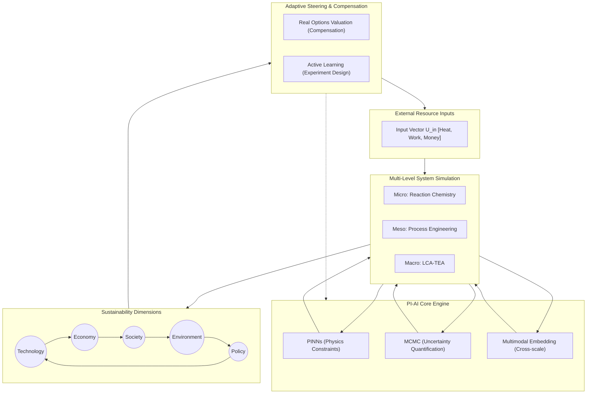

# PhosphogypsumBot: A Physics-Informed AI Platform for Sustainable Phosphorus Resource Cycling
## Technical Building Plan & Implementation Roadmap

> [!NOTE]
> **Project Vision Statement**
> To transform phosphogypsum (PG) utilization from empirical trial-and-error chemistry into a highly predictable, multi-objective, and physics-constrained engineering science. By combining **Physics-Informed Artificial Intelligence (PI-AI)** with **Bayesian Uncertainty Quantification (UQ)**, PhosphogypsumBot serves as an intelligent decision-support system that balances **Technology, Economy, Policy, Environment, and Society (TEPES)** to discover, evaluate, and scale revolutionary PG valorization pathways.

---

## 1. Project Background & Methodological Framework

Phosphogypsum (PG) is an industrial solid waste generated during the production of phosphoric acid via the wet-process treatment of phosphate rock with sulfuric acid:
$$\text{Ca}_5(\text{PO}_4)_3\text{F} + 5\text{H}_2\text{SO}_4 + 10\text{H}_2\text{O} \rightarrow 5(\text{CaSO}_4 \cdot 2\text{H}_2\text{O}) + 3\text{H}_3\text{PO}_4 + \text{HF}$$

For every ton of phosphoric acid ($P_2O_5$) produced, approximately **4.5 to 5.5 tons of PG** are generated. These stockpiles pose severe environmental risks, including leaching of residual acids, heavy metals, and naturally occurring radioactive materials (NORM, primarily Ra-226).

To address this, our **Sustainable Resource Cycling Engineering Science** framework utilizes a closed-loop, multi-level systems approach driven by **PI-AI** to optimize five core sustainability dimensions:



---

## 2. Modular System Architecture Overview

PhosphogypsumBot is designed with a **strictly modular plug-in architecture**. This ensures that the system can scale, accept new chemical pathways, and upgrade its AI engines independently without monolithic refactoring.

### 2.1 Module Registry & Interface Contracts
Every component is a "Module" that registers with a central `ModuleRegistry`. Modules communicate via rigidly defined I/O schemas. For example, any chemical process is encapsulated as a `ValorizationPathwayModule (VPM)`.

```python
class ValorizationPathwayModule(ABC):
    """Abstract interface for all PG treatment pathway PINN models."""
    
    @property
    def module_id(self) -> str: ...
    
    @property  
    def governing_equations(self) -> list[PDE]: ...
    
    @property
    def input_schema(self) -> dict: ...
        # Must include: feedstock_composition, U_heat, U_work, temperature
    
    @property
    def output_schema(self) -> dict: ...
        # Must include: conversion_rate, product_composition, NORM_partitioning
    
    @abstractmethod
    def build_pinn_loss(self, collocation_pts) -> jnp.ndarray: ...
    
    @abstractmethod
    def validate(self, benchmark_data) -> ValidationReport: ...
```

### 2.2 System Integration Map
The system is divided into five logical module groups:
*   **Group A (Data Foundation):** Ingests and structures raw data.
*   **Group B (PI-AI Core):** Executes physics-constrained ML and Bayesian inference.
*   **Group C (Simulation Engine):** Scales predictions from molecular to macroeconomic levels.
*   **Group D (Decision Engine):** Optimizes inputs and calculates policy compensations.
*   **Group E (Platform):** Provides the user interface and orchestration.

---

## 3. Data Foundation Layer (Module Group A)

This layer transforms raw, heterogeneous industrial data into structured, physics-ready inputs.

### Module A1: Data Ingestion & ETL Pipeline
*   **Function:** Handles real-time sensor streams, historic batch logs, and environmental monitoring data.
*   **Tech Stack:** Apache Kafka (streaming), dbt (transformation), DVC (Data Version Control for reproducible Bayesian priors).

### Module A2: Knowledge Graph Engine
*   **Function:** Structures the ontological relationships between chemicals, processes, and policies.
*   **Ontology Schema:**
    *   **Entities:** `PG_Source`, `Impurity` (P2O5, F, Ra-226), `Product` (CaCO3, α-HH), `Process_Unit`, `Regulation`.
    *   **Relations:** `CONTAINS`, `TRANSFORMS_TO`, `CATALYZES`, `RESTRICTED_BY`.
*   **Tech Stack:** Neo4j graph database.

### Module A3: NORM Radioactivity Tracking
*   **Function:** A dedicated sub-module calculating the mass balance and partitioning of Ra-226, U-238, and Th-232 across any chosen VPM.
*   **Output:** Feeds directly into the Environment (Leaching Pollution Index) dimension of the TEPES evaluation.

---

## 4. PI-AI Core Engine (Module Group B)

The intelligence core relies on the `ValorizationPathwayModule (VPM)` interface, allowing seamless addition of new PG treatment technologies.

### 4.1-4.5 VPM Instances (The Chemical Pathways)

| Module ID | VPM B1: Carbothermic Reduction | VPM B2: Hydration & Ettringite | VPM B3: Ammono-Carbonation (Merseburg) | VPM B4: α-Hemihydrate Calcination | VPM B5: REE Selective Extraction |
| :--- | :--- | :--- | :--- | :--- | :--- |
| **Pathway** | Thermal decomposition to SO₂ + CaO | Road base stabilization | Conversion to CaCO₃ + (NH₄)₂SO₄ | High-value plaster/mold production | Strategic La/Ce/Nd recovery |
| **Governing PDE** | Reaction-diffusion heat transfer | Crystallization-pressure diffusion | Gas-liquid-solid mass transfer | Dissolution-recrystallization | Shrinking-core leaching kinetics |
| **NORM Tracking** | Concentrates in CaO ash | Immobilized in C-S-H gel | Partitions >90% into CaCO₃ | Retained in gypsum lattice | Tracked in pregnant leach solution |

### 4.6 Advanced PINN Techniques (Cross-Cutting Module B6)
To handle the complex PDEs of the VPMs, we implement state-of-the-art physics-informed techniques:
*   **Multiscale PINNs (MPINNs):** Addresses the **stiffness problem** (fast reaction vs. slow diffusion) by grouping chemical species with similar time scales and using adaptive-weight loss functions.
*   **Hard Constraint Architectures:** Instead of soft penalties, we use positivity layers (to prevent negative concentrations) and divergence-free layers to strictly enforce mass balance.

### 4.7 Bayesian MCMC Engine (Module B7)
Quantifies parameter uncertainty (reaction rates, activation energies) and market volatility using NumPyro.

```python
import numpyro
import numpyro.distributions as dist
import jax.numpy as jnp
from jax.experimental.ode import odeint

def pg_kinetic_model(t, y, args):
    # True contracting-core ODE implementation
    alpha = y[0]
    k = args[0]
    d_alpha_dt = k * 3 * jnp.power(1.0 - alpha, 2.0/3.0)
    return jnp.array([d_alpha_dt])

def mcmc_inference(time_data, obs_conversion):
    # Priors
    log_A = numpyro.sample('log_A', dist.Normal(12.0, 2.0))
    Ea = numpyro.sample('Ea', dist.Normal(150.0, 20.0))
    k = jnp.exp(log_A - Ea / (8.314 * T_const))
    
    # ODE Integration
    y0 = jnp.array([0.0])
    predicted_alpha = odeint(pg_kinetic_model, y0, time_data, k)
    
    # Likelihood
    sigma = numpyro.sample('sigma', dist.HalfNormal(0.05))
    numpyro.sample('obs', dist.Normal(predicted_alpha[:, 0], sigma), obs=obs_conversion)
```

### 4.8 Multimodal Embedding Engine (Module B8)
Aligns three distinct data scales into a unified latent space using a self-supervised Contrastive Projection Network:
1.  **Micro (GNNs):** Impurity molecular graphs.
2.  **Meso (CNN-Transformers):** Reactor time-series.
3.  **Macro (LLMs):** Policy text and regulations.

---

## 5. Multi-Level Simulation Engine (Module Group C)

This engine bridges scales using explicit coupling protocols.

### Module C1: Micro-Level Reactor Simulator
*   **Input:** Output from VPMs ($\alpha(t,x)$, $T(t,x)$).
*   **Function:** Simulates spatial distribution of reactions within a single reactor unit.

### Module C2: Meso-Level Process Flowsheet Engine
*   **Coupling Protocol (Upscaling):** Integrates micro-level conversion rates over the reactor volume to yield macroscopic mass flow rates ($\dot{m}_{\text{product}}$) and total heat duty ($Q_{total}$).
*   **Function:** Solves steady-state/dynamic mass and energy balances across the entire plant (pumps, kilns, filters).

### Module C3: Macro-Level LCA-TEA Evaluator
*   **Coupling Protocol (Aggregation):** Converts meso-level mass/energy flows into environmental impacts (using ecoinvent factors) and financial cash flows.
*   **Outputs:** NPV, IRR, Global Warming Potential (GWP), Leaching Pollution Index (LPI).

---

## 6. Decision & Optimization Engine (Module Group D)

### Module D1: Real Options Valuation (ROV) Engine
Calculates the exact subsidy required to de-risk high-uncertainty innovations. If the probability of negative NPV exceeds a risk threshold ($P(NPV < 0 | \theta) > \beta_{\text{risk}}$), it back-calculates the required financial injection vector (e.g., carbon credits, direct subsidies).

### Module D2: Multi-Objective Bayesian Optimizer
Uses `BoTorch` to explore the operational parameter space, generating a Pareto Frontier across the TEPES dimensions (e.g., balancing maximum yield vs. minimum carbon footprint).

### Module D3: Active Learning Loop
Uses Upper Confidence Bound (UCB) acquisition functions to identify where model epistemic uncertainty is highest, recommending specific laboratory experiments to the user to maximize information gain.

---

## 7. Platform & Deployment (Module Group E)

*   **Module E1: FastAPI Gateway:** Orchestrates module communication and task queues (Celery).
*   **Module E2: React Dashboard:** Provides 3D Pareto visualizers and interactive input sliders ($U_{heat}, U_{work}, U_{money}$).
*   **Module E3: LLM Chat Agent:** A RAG-enabled assistant querying the Neo4j/Milvus knowledge bases.
*   **Module E4: Deployment & Edge Inference:** Core training runs on SLURM GPU clusters; surrogate GRNN models are deployed to edge devices at the chemical plant for real-time inference.

---

## 8. Development Timeline & Milestones

| Phase | Duration | Module Focus | Key Deliverable | Quantitative Success Criterion |
| :--- | :--- | :--- | :--- | :--- |
| **1. Foundation** | Months 1-3 | Group A | PG Knowledge Graph | >500 regulatory docs parsed; schema validated |
| **2. PI-AI Core** | Months 4-9 | Group B | VPM B1 & B2 | PINN relative error < 5% vs benchmark data |
| **3. MCMC & MLS**| Months 10-12 | B7 & Group C | MCMC pipeline & Flowsheet | Gelman-Rubin $\hat{R} < 1.05$; Mass balance < 1% error |
| **4. Decision** | Months 13-15 | Group D | ROV & Optimizer | Successful Pareto extraction on 3 VPMs |
| **5. Platform** | Months 16-18 | Group E | Full UI Deployment | <500ms latency on surrogate edge inference |

> [!WARNING]
> **Risk Mitigation (Stiffness in PDEs)**
> Chemical kinetics often exhibit extreme stiffness. It is critical to validate the MPINNs (Module B6) on a stiff benchmark (e.g., ROBER problem) before applying them to the complex Merseburg or Calcination VPMs.
