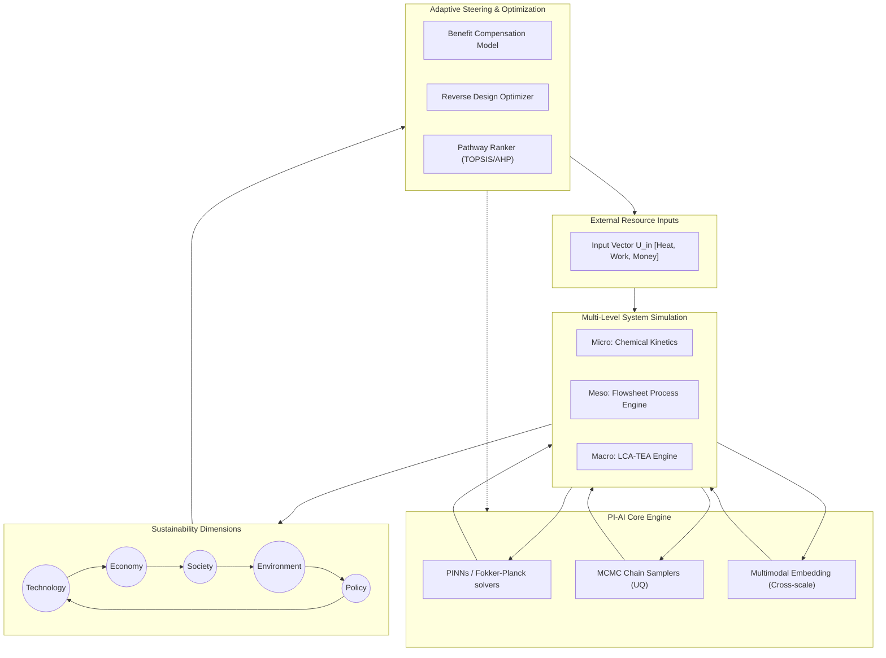

# PhosphogypsumBot: A Physics-Informed AI Platform for Sustainable Phosphorus Resource Cycling
## Technical Building Plan & Implementation Roadmap

> [!NOTE]
> **Project Vision Statement**
> To transform phosphogypsum (PG) utilization from empirical trial-and-error chemistry into a highly predictable, multi-objective, and physics-constrained engineering science. By combining **Physics-Informed Artificial Intelligence (PI-AI)** with **Bayesian Uncertainty Quantification (UQ)**, PhosphogypsumBot serves as an intelligent decision-support system that balances **Technology, Economy, Policy, Environment, and Society (TEPES)** to discover, evaluate, and scale revolutionary PG valorization pathways.
>
> **Implementation Status (v0.5.0)**: The core modules of the platform have been successfully built, integrated, and validated on the **Wuhan University Supercomputing Center (WHU-SCC)**.

---

## 1. Project Background & Methodological Framework

Phosphogypsum (PG) is an industrial solid waste generated during the production of phosphoric acid via the wet-process treatment of phosphate rock with sulfuric acid:
$$\text{Ca}_5(\text{PO}_4)_3\text{F} + 5\text{H}_2\text{SO}_4 + 10\text{H}_2\text{O} \rightarrow 5(\text{CaSO}_4 \cdot 2\text{H}_2\text{O}) + 3\text{H}_3\text{PO}_4 + \text{HF}$$

For every ton of phosphoric acid ($P_2\text{O}_5$) produced, approximately **4.5 to 5.5 tons of PG** are generated. These stockpiles pose severe environmental risks, including leaching of residual acids, heavy metals, and naturally occurring radioactive materials (NORM, primarily Ra-226).

To address this, our **Sustainable Resource Cycling Engineering Science** framework utilizes a closed-loop, multi-level systems approach driven by **PI-AI** to optimize five core sustainability dimensions:



---

## 2. Modular System Architecture Overview

PhosphogypsumBot is designed with a **strictly modular plug-in architecture**. This ensures that the system can scale, accept new chemical pathways, and upgrade its AI engines independently without monolithic refactoring.

### 2.1 Module Registry & Interface Contracts
Every component is a "Module" that registers with a central `ModuleRegistry`. Modules communicate via rigidly defined I/O schemas. For example, any chemical process is encapsulated as a `ValorizationPathwayModule (VPM)`.

The base classes are implemented in [pgloop/pathways/vpms/base_vpm.py](file:///Users/siqi/GitHub/oneLCA-TEA_Phosphogypsum/pgloop/pathways/vpms/base_vpm.py):

```python
from abc import ABC, abstractmethod
from typing import Dict, Any, List
from pydantic import BaseModel

class VPMSchema(BaseModel):
    """Base schema for inputs and outputs of a VPM."""
    pass

class ValidationReport(BaseModel):
    """Report generated after validating the VPM against benchmarks."""
    is_valid: bool
    metrics: Dict[str, float]
    details: str

class ValorizationPathwayModule(ABC):
    """
    Abstract interface for all Phosphogypsum treatment pathway PINN models.
    Enforces a strict modular contract for I/O and physics.
    """
    
    @property
    @abstractmethod
    def module_id(self) -> str:
        """Unique identifier for the module (e.g., 'VPM_carbothermic_reduction')."""
        pass
    
    @property  
    @abstractmethod
    def governing_equations(self) -> List[str]:
        """Returns the list of governing PDEs/ODEs as string representations."""
        pass
    
    @property
    @abstractmethod
    def input_schema(self) -> type[VPMSchema]:
        """Pydantic model defining the expected inputs (Heat, Work, Feedstock)."""
        pass
    
    @property
    @abstractmethod
    def output_schema(self) -> type[VPMSchema]:
        """Pydantic model defining the outputs (Conversion, Purity, NORM partition)."""
        pass
    
    @abstractmethod
    def build_pinn_loss(self, collocation_pts: Any) -> Any:
        """Constructs the physics-informed loss function using PyTorch/JAX."""
        pass
    
    @abstractmethod
    def validate(self, benchmark_data: Any) -> ValidationReport:
        """Validates the model against benchmark data and returns a report."""
        pass
```

### 2.2 System Integration Map
The system is divided into five logical module groups:
*   **Group A (Data Foundation):** Ingests and structures raw text, standards, and literature data into vector-graph indices.
*   **Group B (PI-AI Core):** Executes physics-constrained ML, interatomic property modeling, and Bayesian MCMC inference.
*   **Group C (Simulation Engine):** Scales predictions from micro unit operations to macroscopic LCA-TEA processes.
*   **Group D (Decision Engine):** Ranks pathways, optimizes incentive compensations, and executes reverse Bayesian design.
*   **Group E (Platform):** Orchestrates agent tasks, triggers interactive visualizations, and hosts the LLM chat interface.

---

## 3. Data Foundation Layer (Module Group A)

This layer transforms raw, heterogeneous industrial data, scientific papers, and policy manuals into structured, physics-ready inputs.

### Module A1: Data Ingestion & ETL Pipeline
*   **Implementation Location**: [pgloop/iodata/](file:///Users/siqi/GitHub/oneLCA-TEA_Phosphogypsum/pgloop/iodata/)
*   **Function:** Handles document extraction and standardization.
    *   **PDF Ingestion:** Uses a PyMuPDF and MinerU parsing engine ([pdf_parser.py](file:///Users/siqi/GitHub/oneLCA-TEA_Phosphogypsum/pgloop/iodata/pdf_parser.py)) for parsing complex tables, layouts, and OCR text in scientific PDFs.
    *   **Web Scraper:** Collects regional electricity grid data, chemical prices, and environmental standards ([web_scraper.py](file:///Users/siqi/GitHub/oneLCA-TEA_Phosphogypsum/pgloop/iodata/web_scraper.py)).
    *   **Data Standardizer:** Normalizes inputs into uniform industrial metrics ([data_standardizer.py](file:///Users/siqi/GitHub/oneLCA-TEA_Phosphogypsum/pgloop/iodata/data_standardizer.py)).

### Module A2: Knowledge Graph & RAG Engine
*   **Implementation Location**: [pgloop/knowledge/](file:///Users/siqi/GitHub/oneLCA-TEA_Phosphogypsum/pgloop/knowledge/)
*   **Function:** Builds and queries the system's ontological domain knowledge base.
    *   **Extraction:** Uses an LLM information extractor ([llm_extractor.py](file:///Users/siqi/GitHub/oneLCA-TEA_Phosphogypsum/pgloop/knowledge/llm_extractor.py)) to map entities (`PG_Source`, `Impurity`, `Product`, `Process_Unit`, `Regulation`) and relations (`CONTAINS`, `TRANSFORMS_TO`, `CATALYZES`, `RESTRICTED_BY`).
    *   **Validation & Constraints:** Automatically evaluates extracted parameters against physical boundaries ([parameter_ranges.py](file:///Users/siqi/GitHub/oneLCA-TEA_Phosphogypsum/pgloop/knowledge/parameter_ranges.py)) and solves missing values under thermodynamic limits ([gap_filler.py](file:///Users/siqi/GitHub/oneLCA-TEA_Phosphogypsum/pgloop/knowledge/gap_filler.py)).
    *   **Storage & Query:** Interfaces with Neo4j ([graph/neo4j_adapter.py](file:///Users/siqi/GitHub/oneLCA-TEA_Phosphogypsum/pgloop/knowledge/graph/neo4j_adapter.py)) and local vector-graph models (**LightRAG** / **RAGAnything** in [lightrag_engine.py](file:///Users/siqi/GitHub/oneLCA-TEA_Phosphogypsum/pgloop/knowledge/lightrag_engine.py)).

### Module A3: Materials Database & NORM Radioactivity Tracking
*   **Implementation Location**: [pgloop/chemicals/](file:///Users/siqi/GitHub/oneLCA-TEA_Phosphogypsum/pgloop/chemicals/)
*   **Function:** Integrates material property databases and incorporates a **MACE machine-learning interatomic potential** predictor to estimate physical properties (e.g., lattice structures, phase transition boundaries). Tracks mass balance and partitioning of heavy metals and radioactive isotopes (Ra-226, U-238, Th-232) across VPM processes.

---

## 4. PI-AI Core Engine (Module Group B)

The intelligence core relies on the `ValorizationPathwayModule (VPM)` interface, allowing seamless addition of new PG treatment technologies.

### 4.1-4.5 VPM Instances (The Chemical Pathways)
Located in [pgloop/pathways/vpms/](file:///Users/siqi/GitHub/oneLCA-TEA_Phosphogypsum/pgloop/pathways/vpms/):

| Module ID | B1: Carbothermic Reduction | B2: Hydration & Ettringite | B3: Ammono-Carbonation (Merseburg) | B4: α-Hemihydrate Calcination | B5: REE Selective Extraction |
| :--- | :--- | :--- | :--- | :--- | :--- |
| **Pathway** | Thermal decomposition to SO₂ + CaO (Sulfuric Acid & Cement Co-production) | Road base stabilization | Conversion to CaCO₃ + (NH₄)₂SO₄ | High-value plaster/mold production | Strategic La/Ce/Nd recovery |
| **Macro Class** | [SulfurAcidPathway](file:///Users/siqi/GitHub/oneLCA-TEA_Phosphogypsum/pgloop/pathways/pg_sulfur_acid.py) | [ConstructionPathway](file:///Users/siqi/GitHub/oneLCA-TEA_Phosphogypsum/pgloop/pathways/pg_construction.py) / [SoilAmendmentPathway](file:///Users/siqi/GitHub/oneLCA-TEA_Phosphogypsum/pgloop/pathways/pg_soil_amendment.py) | [ChemicalRecoveryPathway](file:///Users/siqi/GitHub/oneLCA-TEA_Phosphogypsum/pgloop/pathways/pg_chemical_recovery.py) | [CementPathway](file:///Users/siqi/GitHub/oneLCA-TEA_Phosphogypsum/pgloop/pathways/pg_cement.py) | [REEExtractionPathway](file:///Users/siqi/GitHub/oneLCA-TEA_Phosphogypsum/pgloop/pathways/pg_ree_extraction.py) |
| **Governing PDE** | Reaction-diffusion heat transfer | Crystallization-pressure diffusion | Gas-liquid-solid mass transfer | Dissolution-recrystallization | Shrinking-core leaching kinetics |
| **NORM Tracking** | Concentrates in CaO ash | Immobilized in C-S-H gel | Partitions >90% into CaCO₃ | Retained in gypsum lattice | Tracked in pregnant leach solution |

### 4.6 Advanced PINN & Stochastic Solvers
*   **Implementation Location**: [pgloop/stochastic_dynamics/](file:///Users/siqi/GitHub/oneLCA-TEA_Phosphogypsum/pgloop/stochastic_dynamics/)
*   **Function:** Solves physical transport boundaries and chemical phase density states.
    *   **Fokker-Planck Solver:** Computes multi-dimensional density distributions over time using Fokker-Planck PDE models ([fokker_planck.py](file:///Users/siqi/GitHub/oneLCA-TEA_Phosphogypsum/pgloop/stochastic_dynamics/fokker_planck.py)).
    *   **PINN Architectures:** Integrates PyTorch neural networks optimized for solving Fokker-Planck transport boundaries ([pinn.py](file:///Users/siqi/GitHub/oneLCA-TEA_Phosphogypsum/pgloop/stochastic_dynamics/pinn.py)).
    *   **Latent SDEs & VAEs:** Captures stochastic process anomalies and molecular dynamics ([latent_sde.py](file:///Users/siqi/GitHub/oneLCA-TEA_Phosphogypsum/pgloop/stochastic_dynamics/latent_sde.py), [vae.py](file:///Users/siqi/GitHub/oneLCA-TEA_Phosphogypsum/pgloop/stochastic_dynamics/vae.py)).

### 4.7 Bayesian MCMC Engine
*   **Implementation Location**: [pgloop/uncertainty/](file:///Users/siqi/GitHub/oneLCA-TEA_Phosphogypsum/pgloop/uncertainty/)
*   **Function:** Quantifies parameter uncertainty (reaction rates, activation energies) and propagates process variance.
    *   **Samplers:** Custom Python implementations of **Metropolis-Hastings**, **Hamiltonian Monte Carlo**, and **Gibbs Sampler** ([chain_sampling.py](file:///Users/siqi/GitHub/oneLCA-TEA_Phosphogypsum/pgloop/uncertainty/chain_sampling.py)) to calibrate joint parameter distributions.
    *   **Bayesian Updater:** Executes closed-loop inference updating parameter distributions based on real-time observations ([bayesian_update.py](file:///Users/siqi/GitHub/oneLCA-TEA_Phosphogypsum/pgloop/uncertainty/bayesian_update.py)).
    *   **Sensitivity Screening:** Performs global sensitivity analysis using Sobol and Delta indices ([sensitivity.py](file:///Users/siqi/GitHub/oneLCA-TEA_Phosphogypsum/pgloop/uncertainty/sensitivity.py)).

```python
# Conceptual framework for our Metropolis-Hastings Sampler class
class MetropolisHastings(BaseMCMC):
    """Metropolis-Hastings MCMC Sampler for parameter calibration."""
    
    def sample(self, n_samples: int, warmup: int = 1000, adapt_proposal: bool = True) -> MCMCResult:
        # Runs random-walk MCMC sampling over parameter priors, computes
        # acceptance rates based on log_prob_fn(state) and returns calibrated posterior distributions.
        ...
```

---

## 5. Multi-Level Simulation Engine (Module Group C)

This engine bridges physical scales from reactors to global economics using explicit upscaling coupling protocols.

### Module C1: Micro-Level Unit Operations
*   **Implementation Location**: [pgloop/equipment/](file:///Users/siqi/GitHub/oneLCA-TEA_Phosphogypsum/pgloop/equipment/)
*   **Function:** Simulates physical reactor hardware units.
    *   Includes modeling of **CSTR Reactors**, **Leaching Tanks**, **Mixing Tanks**, and **Separation Filters**.
    *   Couples reaction kinetics (VPM outputs) directly to unit mass-energy conservation boundaries.

### Module C2: Meso-Level Flowsheet Process Engine
*   **Implementation Location**: [pgloop/simulation/](file:///Users/siqi/GitHub/oneLCA-TEA_Phosphogypsum/pgloop/simulation/)
*   **Function:** Solves mass and energy balances across the plant flowsheet (`micro/` reactor outputs scaling to `meso/` factory streams). Calculates aggregate parameters (total steam $U_{heat}$, electrical energy $U_{work}$, raw material streams).

### Module C3: Macro-Level LCA-TEA Evaluator
*   **Implementation Location**: [pgloop/lca/](file:///Users/siqi/GitHub/oneLCA-TEA_Phosphogypsum/pgloop/lca/) & [pgloop/tea/](file:///Users/siqi/GitHub/oneLCA-TEA_Phosphogypsum/pgloop/tea/)
*   **Function:** Evaluates life-cycle environmental and techno-economic footprints.
    *   **LCAEngine:** Compiles the Life Cycle Inventory (LCI) and scales environmental indicators (including GWP, water footprint, particulate matter, NORM exposure) based on ISO 14040/14044 norms.
    *   **TEAEngine:** Calculates Capital Expenditures (CAPEX), Operational Expenditures (OPEX), revenues, and tracks conventional financial metrics (NPV, IRR, Payback Period).

---

## 6. Decision & Optimization Engine (Module Group D)

This layer converts physical and economic metrics into policy recommendations and optimal process parameters.

### Module D1: Benefit Compensation Model
*   **Implementation Location**: [pgloop/decision/benefit_compensation.py](file:///Users/siqi/GitHub/oneLCA-TEA_Phosphogypsum/pgloop/decision/benefit_compensation.py)
*   **Function:** Optimizes financial support parameters. Evaluates avoided environmental damage based on **shadow pricing** and back-calculates required carbon tax credits, tipping fees, or direct government subsidies to make low-margin, high-benefit pathways profitable.

### Module D2: Reverse Design Optimizer
*   **Implementation Location**: [pgloop/decision/optimizer/reverse_design.py](file:///Users/siqi/GitHub/oneLCA-TEA_Phosphogypsum/pgloop/decision/optimizer/reverse_design.py)
*   **Function:** Uses Bayesian Optimization with a **Gaussian Process Regressor** (Matern kernel) to back-calculate required process inputs (e.g., solid-liquid ratios, operating temperatures, or material purity) that satisfy target threshold constraints (e.g., GWP $\le$ 100 kg CO₂-eq/t, NPV $\ge$ \$20/t).

### Module D3: Multi-Criteria Pathway Ranker
*   **Implementation Location**: [pgloop/decision/mcda.py](file:///Users/siqi/GitHub/oneLCA-TEA_Phosphogypsum/pgloop/decision/mcda.py) & [recommender.py](file:///Users/siqi/GitHub/oneLCA-TEA_Phosphogypsum/pgloop/decision/recommender.py)
*   **Function:** Ranks pathways across TEPES criteria using Multi-Criteria Decision Analysis (**TOPSIS**, **AHP**, and WSM). Computes ideal and anti-ideal solution vectors to find the most balanced pathway.

### Module D4: Micro & Macro Risk Assessment
*   **Implementation Location**: [pgloop/risk/](file:///Users/siqi/GitHub/oneLCA-TEA_Phosphogypsum/pgloop/risk/)
*   **Function:** Aggregates process-level (technical, operational) and regional-level (political, policy, carbon tax volatility) risks into unified safety boundaries.

---

## 7. Platform & Deployment (Module Group E)

### Module E1: Streamlit Dashboard
*   **Implementation Location**: [pgloop/visualization/dashboard.py](file:///Users/siqi/GitHub/oneLCA-TEA_Phosphogypsum/pgloop/visualization/dashboard.py)
*   **Function:** Renders an interactive web interface. Includes 3D Pareto frontier visualizations, process parameter sliders, Monte Carlo distributions, and TEPES dimension graphs.

### Module E2: Report Exporter
*   **Implementation Location**: [pgloop/visualization/report.py](file:///Users/siqi/GitHub/oneLCA-TEA_Phosphogypsum/pgloop/visualization/report.py)
*   **Function:** Compiles analytical outputs, MCDA rankings, and uncertainty charts into standard HTML and Excel spreadsheets for engineering reviews.

### Module E3: LLM ReAct Chat Agent
*   **Implementation Location**: [chat_agent/](file:///Users/siqi/GitHub/oneLCA-TEA_Phosphogypsum/chat_agent/)
*   **Function:** Hosts a terminal CLI and API connector ([agent.py](file:///Users/siqi/GitHub/oneLCA-TEA_Phosphogypsum/chat_agent/agent.py)) driven by a ReAct reasoning loop. The agent automatically parses Python signatures into JSON schema tool formats ([tools.py](file:///Users/siqi/GitHub/oneLCA-TEA_Phosphogypsum/chat_agent/tools.py)), allowing it to call core backend modules (e.g., executing LCA-TEA simulations, searching scientific literature via LightRAG, ranking pathways).

### Module E4: WHU-SCC Slurm Clusters
*   **Implementation Location**: [slurm_jobs/](file:///Users/siqi/GitHub/oneLCA-TEA_Phosphogypsum/slurm_jobs/)
*   **Function:** Orchestrates training and inference on the Wuhan University Supercomputing Center. Manages conda environments, local HuggingFace/ollama servers, and implements **NUMA node binding (`numactl --cpunodebind`)** to optimize EPYC CPU memory alignment.

---

## 8. Development Timeline & Milestones

### Historical Releases & Completed Milestones
*   **Phase 1: Foundation (v0.1.0 - v0.2.0)**
    *   *Achievements*: Authoring core mathematical models (LCA/TEA engines). Constructing Neo4j databases and parser pipelines (MinerU/PyMuPDF pdf extraction).
*   **Phase 2: Physics-Informed AI (v0.3.0)**
    *   *Achievements*: Writing Fokker-Planck solvers and VPM kinetics. Building MCMC chain samplers (Metropolis-Hastings, Hamiltonian MC) for Bayesian uncertainty.
*   **Phase 3: Decision & System Optimization (v0.5.0 - Current)**
    *   *Achievements*: Integrating the Reverse Design GP optimizer, Benefit Compensation model, and MCDA TOPSIS ranker. Authoring the Streamlit dashboard and implementing the ReAct Chat Agent. Deploying on WHU-SCC Slurm clusters with GPU acceleration.

### Next-Phase Plans: Road to Production (v0.5.0)

| Focus Area | Target Date | Module Focus | Core Deliverable | Success Criteria |
| :--- | :--- | :--- | :--- | :--- |
| **Multi-Scale Scaling** | Month 19-21 | Group C & E | Large-scale Neo4j & Milvus deployment | Ingestion of >5,000 papers; latency < 200ms |
| **Production PINNs** | Month 22-24 | Group B | Fokker-Planck stiff boundary optimizations | Integration error < 1% vs CFD benchmarks |
| **Material MACE Validation**| Month 25-26 | chemicals | Machine learning interatomic properties | MACE validation error < 0.05 eV/atom |
| **Field Validation** | Month 27-28 | Field Test | Real-time plant edge server integration | Real-time sensor-to-dashboard pipeline |

> [!WARNING]
> **Risk Mitigation (Stiffness in PDEs)**
> Chemical kinetics often exhibit extreme stiffness (fast reaction vs slow diffusion). In Phase 6, we must prioritize testing our multiscale MPINNs on stiff CFD benchmarks (e.g. Merseburg reactor profiles) to ensure numerical stability when solving high-pressure crystallization models.
