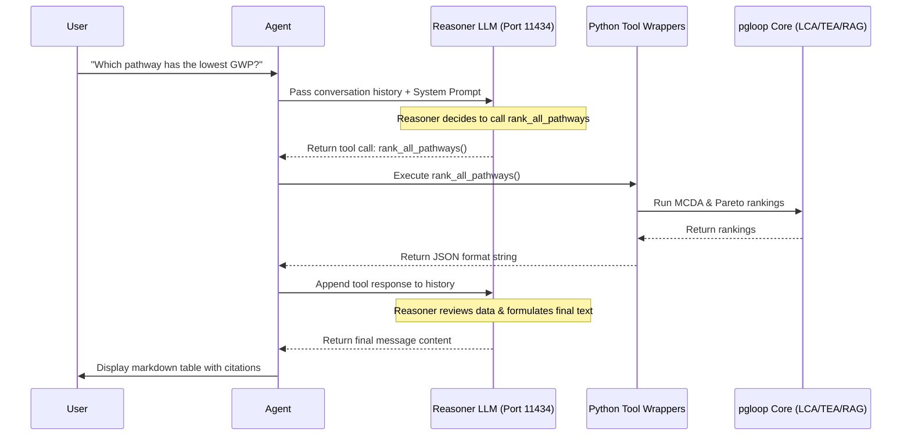

# Chat Agent Internal Mechanisms

The **Chat Agent** module (located in `chat_agent/`) is the central orchestration layer for PhosphogypsumBot. It exposes backend LCA, TEA, and GraphRAG tools to a natural-language-driven interface using an autonomous **ReAct (Reasoning and Acting)** execution loop.

---

## 🛠️ System Architecture

The agent mediates between user natural language queries and structured computational engines:



---

## 1. Core ReAct Loop (`chat_agent/agent.py`)

The orchestration is implemented inside the `PhosphogypsumAgent` class. 

### 1.1 Persona and Prompt Rules
The agent is governed by a strict **System Prompt** defining its persona and behavior:
1.  **Factual Inquiries**: All claims regarding GWP, NPV, or pathway metrics must be backed by calling `calculate_lca_tea` or `rank_all_pathways`.
2.  **Literature Reference**: Direct scientific queries must invoke `search_literature` to pull GraphRAG nodes.
3.  **Error Resilience**: If a tool fails, the agent reports the exact stack trace and suggests alternatives.
4.  **Scientific Formatting**: Outputs must use Markdown tables, bullets, and LaTeX-style math where applicable.

### 1.2 Tool Calling Execution
The loop iterates up to `5` times per user query. If the Reasoner returns `tool_calls`, the agent runs them locally, maps their returns to a `tool` role, and sends the context back to the LLM to decide on the next action.

---

## 2. Dynamic Schema Generator

To avoid manual JSON Schema updates when tools change, `chat_agent/agent.py` contains the `function_to_schema()` helper. It uses python's `inspect` and regular expression docstring parsing to automatically translate standard Python functions into OpenAI-compatible tools:

```python
def function_to_schema(func: Callable) -> dict:
    # 1. Reads function parameters & type annotations
    # 2. Extracts parameter descriptions from docstring "Args:" block
    # 3. Formats parameters into standard JSON schemas
```

---

## 3. Core Tool Directory (`chat_agent/tools.py`)

The agent has access to 5 major tools that interface with `pgloop` capabilities:

### 1. `get_available_pathways`
*   **Purpose**: Returns all registered phosphogypsum valorization pathway codes.
*   **Signature**: `get_available_pathways() -> str`
*   **Output**: A list of valid codes (e.g., `PG-Stack`, `PG-CementProd`, `PG-REEextract`).

### 2. `search_literature`
*   **Purpose**: Queries the GraphRAG (LightRAG) vector-graph database containing parsed scientific papers.
*   **Signature**: `search_literature(query: str, mode: str = "hybrid") -> str`
*   **Supported Modes**:
    *   `hybrid`: Combines vector database retrieval with relationship-graph queries.
    *   `local`: Specific entity searches.
    *   `global`: Global summaries across papers.

### 3. `calculate_lca_tea`
*   **Purpose**: Performs complete forward Life Cycle Assessment and Techno-Economic Analysis for a single pathway.
*   **Signature**: `calculate_lca_tea(pathway_code: str) -> str`
*   **Output**: Returns scaled LCA impacts (e.g. GWP, Human Toxicity) and economic parameters (e.g. CAPEX, OPEX, CLCC, NPV, IRR, payback years).

### 4. `rank_all_pathways`
*   **Purpose**: Invokes the Multi-Criteria Decision Analysis (MCDA) ranker across all pathways.
*   **Signature**: `rank_all_pathways() -> str`
*   **Output**: Ranks pathways using weighted indicators and identifies Pareto optimal recommendations.

### 5. `run_market_robustness_scenario`
*   **Purpose**: Simulates the selected pathway under various macroeconomic regimes.
*   **Signature**: `run_market_robustness_scenario(pathway_code: str) -> str`
*   **Output**: Reports costs (CLCC) under Baseline, Optimistic, and Pessimistic scenarios.

---

## 🚀 4. Executing the Agent CLI

To run the agent locally or on a supercomputer computing node:

```bash
# Interactive chat shell
PYTHONPATH=. python -m chat_agent.cli

# Single-query execution
PYTHONPATH=. python -m chat_agent.cli --query "Compare the environmental impacts of cement production vs stacking."
```
