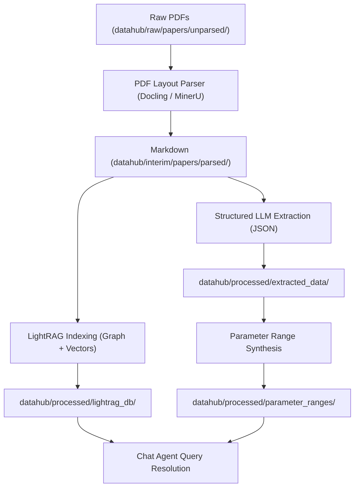

# Multimodal Knowledge Graph Ingestion & Extraction Pipeline

This document describes how PhosphogypsumBot ingests unstructured chemical literature, parses formulas and process flow diagrams, extracts technical parameters, and indexes them into a unified vector-graph database.

---

## 🧠 The RAG Specialization Paradigm

To act as a domain expert, the agent's LLM is not fine-tuned (which modifies weights permanently and is expensive). Instead, it uses **RAG (Retrieval-Augmented Generation)**. Its internal knowledge base dynamically grows as new scientific literature is ingested:



---

## 🔄 The 5 Ingestion Stages

Developers can trigger individual stages or execute the full pipeline via the central orchestration script:

```bash
# Run the entire pipeline in sequence
python scripts/build_knowledge_graph.py --step all

# Or run specific stages
python scripts/build_knowledge_graph.py --step parse
python scripts/build_knowledge_graph.py --step index
```

### 1. Phase 1: PDF Layout Parsing (PDF → Markdown)
*   **Module**: `pgloop/iodata/pdf_parser.py`
*   **Action**: Reads raw scientific papers from `datahub/raw/papers/unparsed/` and converts them to clean markdown files in `datahub/interim/papers/parsed/`.
*   **Technological Engine**:
    *   **Docling Mode**: Precision parsing of tables, markdown hierarchy, and chemical formulas.
    *   **PyMuPDF Mode**: Best for fast, text-only papers.
    *   **MinerU Mode**: Best for complex engineering documents with figures and mathematical formulas.

### 2. Phase 2: GraphRAG Ingest (Markdown → Relational Graph & Vectors)
*   **Module**: `pgloop/knowledge/lightrag_engine.py`
*   **Action**: Reads parsed markdown documents, splits them into semantic chunks, and builds a dual vector-graph representation inside `datahub/processed/lightrag_db/`.
*   **Mechanism**:
    *   Generates semantic embeddings using the embedding server on port `11436` (Qwen3-Embedding).
    *   Uses the Reasoner LLM (Qwen3.8-Flash-Next) on port `11434` to extract entity-relationship nodes:
        *   `Phosphogypsum` -> `CONTAINS` -> `CaSO4 (95%)`
        *   `Carbothermic Reduction` -> `REQUIRES` -> `Temperature (1200°C)`

### 3. Phase 3: Structured Data Extraction (Markdown → JSON)
*   **Module**: `pgloop/knowledge/llm_extractor.py`
*   **Action**: Performs zero-shot structured schema extraction from the parsed texts, outputting JSON files inside `datahub/processed/extracted_data/`.
*   **Schema Fields Extracted**:
    1.  **Composition**: pH, $CaSO_4$ purity, heavy metals, radioactivity ($^{226}Ra$, $^{238}U$, $^{232}Th$).
    2.  **Technology**: Technology Readiness Level (TRL), reaction conditions (temperature, pressure, residence time).
    3.  **LCI (Life Cycle Inventory)**: Raw materials, heat/steam duties, electricity demands, chemical inputs, yields.
    4.  **Cost**: Capital expenditure (CAPEX), operating expenditure (OPEX), revenues.
    5.  **Policy**: Local carbon pricing, subsidies, regulatory limits.

### 4. Phase 4: Parameter Range Synthesis (JSON → Statistics)
*   **Module**: `pgloop/knowledge/parameter_ranges.py`
*   **Action**: Aggregates all parsed JSONs in `extracted_data/` and builds statistical parameter distributions (mean, min, max, standard deviation) saved inside `datahub/processed/parameter_ranges/`.
*   **Purpose**: These ranges serve as prior parameter bounds for Bayesian Uncertainty Propagation (MCMC) and Monte Carlo simulations.

### 5. Phase 5: Domain Knowledge Graph Compiling (JSON → NetworkX Graph)
*   **Module**: `pgloop/knowledge/` (PhosphogypsumKG)
*   **Action**: Structures all extracted facts into the final domain-specific knowledge graph database in `datahub/processed/knowledge_graph/`.

---

## 📈 Multi-Scale Ingestion Schema

The pipeline aligns heterogeneous data across three distinct boundaries:

| Dimension | Input Data | Ingestion Strategy | Output Representation |
| :--- | :--- | :--- | :--- |
| **Literature** | PDFs (papers, reports) | MinerU PDF Layout Parser | Structured Markdown & LightRAG graph nodes |
| **LCA Inventories** | Excel/CSV spreadsheets | `pgloop/iodata/data_standardizer.py` | Unit processes inside the LCA Engine |
| **Reactor Simulation** | Kinetic curves & equations | Analytical physics solvers | VPM models used as tools by the agent |
| **Economic Data** | Market prices, local carbon tax | Structured JSON scraper | OPEX/CAPEX parameter databases |
