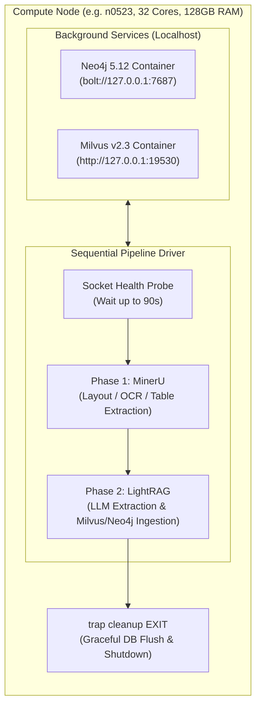
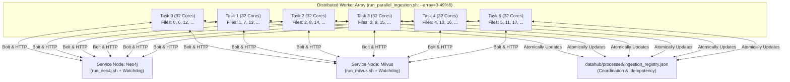

# High-Performance Computing (HPC) Execution Guide

This directory contains the production Slurm workload specifications and orchestration scripts for **PhosphogypsumBot** on the **Wuhan University Supercomputing Center (WHU-SCC)** cluster.

---

## 1. Quick Start (Cheatsheet)

Always navigate to `slurm_jobs` first before submitting, or submit directly from the project root. Both submission patterns are natively supported through automatic workspace anchoring.

```bash
cd slurm_jobs
```

### Scenario A: Ingest New Papers (Daily / Incremental $\le 35$ Papers)
Use the self-contained ephemeral pipeline. It starts containerized Neo4j and Milvus services in the background, parses PDFs with MinerU, indexes graph and vector embeddings via LightRAG, and automatically shuts down upon completion with **zero wasted idle compute hours**:

```bash
sbatch run_auto_pipeline.sh
```

### Scenario B: Massive Literature Batch Ingestion ($> 35$ Papers)
Use the distributed multi-node pipeline with autonomous idle-timeout watchdogs:

```bash
# 1. Launch standalone database services (Both have 30-min idle auto-termination watchdogs)
sbatch run_neo4j.sh
sbatch run_milvus.sh

# 2. Launch the 6-worker distributed array (192 cores total across nodes)
sbatch run_parallel_ingestion.sh
```

### Scenario C: Run Autonomous Agent Reasoning & Techno-Economic Optimization
Execute multi-criteria decision queries against the fully populated Knowledge Graph:

```bash
# Full A100 GPU acceleration (Qwen3.8-Flash-Next)
sbatch -p a100x4 --gres=gpu:4 run_phosphogypsum_agent.sh --flash

# CPU-only execution on 9a14a partition (32-192 cores)
sbatch -p 9a14a --cpus-per-task=192 run_phosphogypsum_agent.sh --flash
```

### Scenario D: Monitor Jobs and Stream Logs
```bash
# Check status of running jobs
squeue -u $USER

# Follow live output (all logs stream to logs/slurm/ via transparent symlink)
tail -f logs/slurm/auto_pipeline_*.log

# Check progress in registry
cat ../datahub/processed/ingestion_registry.json | grep '"status": "success"' | wc -l
```

---

## 2. Smart Ingestion Dispatcher (`scripts/submit_ingestion.sh`)

For users who prefer an automated CLI facade rather than manually deciding between single-node and distributed array pipelines, the project provides [`scripts/submit_ingestion.sh`](../scripts/submit_ingestion.sh).

### Automatic Workload Analysis & Routing
When run with no arguments, the dispatcher inspects `datahub/raw/papers/unparsed/` and compares it against `datahub/processed/ingestion_registry.json`:
* **Zero Pending Papers**: Exits immediately without consuming any compute quota.
* **$\le 35$ Pending Papers**: Automatically submits the single-node ephemeral pipeline (`run_auto_pipeline.sh`) for rapid startup with zero queue fragmentation.
* **$> 35$ Pending Papers**: Launches standalone Neo4j and Milvus services with 30-minute idle watchdogs, waits for endpoints to register, and launches the 6-worker distributed array (`run_parallel_ingestion.sh`).
* **Active Databases Detected**: If database services are already running, directly dispatches the worker array.

### CLI Usage & Commands

You can run the dispatcher from the repository root or directly from the `scripts/` directory:

```bash
# From repository root (Recommended):
./scripts/submit_ingestion.sh [COMMAND]

# Or from inside scripts/ directory:
cd scripts
./submit_ingestion.sh [COMMAND]
```

| Command | Description |
| :--- | :--- |
| `submit_ingestion.sh` | **Smart Mode (Default)**: Automatically counts unparsed papers and selects the most cost-effective pipeline. |
| `submit_ingestion.sh --status` (`-s`) | **Status Inspection**: Displays active Slurm jobs, live database endpoints (Neo4j / Milvus), and parsed paper counts. |
| `submit_ingestion.sh --auto` (`-a`) | **Force Ephemeral**: Submits `run_auto_pipeline.sh` (single-node self-contained). |
| `submit_ingestion.sh --distributed` (`-d`) | **Force Distributed**: Launches dedicated DB services + 6-node array (`run_parallel_ingestion.sh`). |
| `submit_ingestion.sh --stop` | **Emergency Teardown**: Cancels all active database services and ingestion jobs; clears stale endpoints. |
| `submit_ingestion.sh --help` (`-h`) | Displays CLI usage instructions. |

### Practical Examples

**Option 1: From repository root (Recommended)**
```bash
./scripts/submit_ingestion.sh              # 1. Smart submit based on pending document count
./scripts/submit_ingestion.sh --status     # 2. Check real-time cluster status & registered DB ports
./scripts/submit_ingestion.sh --stop       # 3. Cleanly shutdown everything when finished
```

**Option 2: From inside `scripts/` directory**
```bash
cd scripts
./submit_ingestion.sh              # 1. Smart submit based on pending document count
./submit_ingestion.sh --status     # 2. Check real-time cluster status & registered DB ports
./submit_ingestion.sh --stop       # 3. Cleanly shutdown everything when finished
```

---

## 3. Script Catalog & Decision Matrix

| Script | Partition | Resources | Lifecycle & Safety | Primary Use Case |
| :--- | :--- | :--- | :--- | :--- |
| **[`run_auto_pipeline.sh`](./run_auto_pipeline.sh)** | `9a14a` | 32 cores, 128GB RAM | **Ephemeral**: Background DBs auto-terminate via `trap cleanup` | Incremental ingestion ($\le 35$ papers); unattended batch runs. |
| **[`run_parallel_ingestion.sh`](./run_parallel_ingestion.sh)** | `9a14a` | 6 workers $\times$ 32 cores = 192 cores | **Fail-Fast**: Aborts immediately if DB endpoints are unreachable | Large-scale parallel ingestion array ($> 35$ papers). |
| **[`run_neo4j.sh`](./run_neo4j.sh)** | `9a14a` | 32 cores, 128GB RAM | **Watchdog**: Auto-terminates if idle for 30 minutes | Dedicated Neo4j 5.12 service endpoint for distributed workers. |
| **[`run_milvus.sh`](./run_milvus.sh)** | `9a14a` | 32 cores, 128GB RAM | **Watchdog**: Auto-terminates if idle for 30 minutes | Dedicated Milvus v2.3.10 standalone service endpoint. |
| **[`run_phosphogypsum_agent.sh`](./run_phosphogypsum_agent.sh)** | `a100x4` / `gpu` / `9a14a` | 1-4 GPUs or 32-192 CPUs | **Interactive/Batch**: Runs local llama-server + Plan-and-Solve Agent | Complex techno-economic trade-off evaluation & LCA queries. |
| **[`run_cpu_reasoner.sh`](./run_cpu_reasoner.sh)** | `9a14a` | 192 cores, 768GB RAM | **Service**: Dedicated llama-server CPU endpoint | Dedicated high-context CPU reasoning daemon. |
| **[`run_dual_v100.sh`](./run_dual_v100.sh)** | `gpu` | 2 nodes $\times$ 4 V100s | Dedicated distributed GPU cluster | Multi-GPU inference serving for 35B+ models. |
| **[`run_dual_a100.sh`](./run_dual_a100.sh)** | `a100x4` | 2 A100 GPUs (40GB/80GB) | Dedicated high-throughput inference | High-concurrency agent benchmark generation. |
| **[`test_kg_pipeline_cpu.sh`](./test_kg_pipeline_cpu.sh)** | `9a14a` | 32 cores, 128GB RAM | **Smoke Test**: 1-paper CPU validation | Quick verification of MinerU + LightRAG CPU stack. |
| **[`test_kg_pipeline_v100.sh`](./test_kg_pipeline_v100.sh)** | `gpu` | 4 V100 GPUs | **Smoke Test**: 1-paper GPU validation | Quick verification of CUDA layout acceleration. |
| **[`test_kg_pipeline_a100.sh`](./test_kg_pipeline_a100.sh)** | `a100x4` | 2 A100 GPUs | **Smoke Test**: 1-paper GPU validation | High-speed single-paper verification on A100s. |

---

## 4. System Architecture & Workload Topologies

### Topology 1: Ephemeral Self-Contained Pipeline (`run_auto_pipeline.sh`)
Designed for **zero idle resource wastage**. Everything runs within a single Slurm allocation and automatically shuts down when ingestion finishes:



### Topology 2: Distributed Array Pipeline (`run_parallel_ingestion.sh`)
Designed for **large-scale batch throughput**. A dedicated array of 6 concurrent workers divides the document list using modulo sharding (`idx % 6 == SLURM_ARRAY_TASK_ID`):



---

## 5. WHU-SCC Cluster Hard Constraints & Policies

To prevent job rejections or filesystem quota violations, all scripts are engineered to comply with the following Wuhan University Supercomputing Center policies:

### 1. The `9a14a` Partition 32-Core Minimum Rule
* **Hardware Architecture**: Dual AMD EPYC 9A14 ("Bergamo") CPUs, 192 physical Zen4c cores per node, 768 GB DDR5 RAM ($4\text{ GB per core}$).
* **Slurm QoS Enforcement**: Any Slurm job requesting `< 32` cores will be **immediately rejected** by the scheduler:
  ```text
  sbatch: error: Batch job submission failed: Job violates accounting/QOS policy (MinCoreLimit)
  ```
* **Production Standard**: All CPU jobs in this directory specify:
  ```bash
  #SBATCH --partition=9a14a
  #SBATCH --cpus-per-task=32
  #SBATCH --mem=128G
  ```
* **Array Saturation**: In `run_parallel_ingestion.sh`, `--array=0-49%6` runs 6 concurrent tasks $\times$ 32 cores = **exactly 192 cores**, perfectly saturating 1 physical compute node without fractional resource wastage.

### 2. Zero-Quota Storage Policy
* The `/home/tangsiqi` home directory has a strict quota ($< 5\text{ GB}$).
* **Rules strictly observed by all scripts**:
  1. All pre-built Apptainer/Singularity SIF images reside in `/scratch/tangsiqi/containers/images/`.
  2. Model caches (`TIKTOKEN_CACHE_DIR`, HuggingFace, ModelScope) are pointed to `/scratch/tangsiqi/` or shared read-only mounts.
  3. All database persistence directories (`neo4j/data`, `milvus/data`) write directly to the project directory or `/scratch/`.

### 3. AMD Zen4c NUMA Optimization
* To prevent thread thrashing and cgroup lockups in PyTorch and ONNX Runtime across AMD NUMA nodes, all scripts export:
  ```bash
  export ORT_DISABLE_THREAD_AFFINITY=1
  export OMP_NUM_THREADS=32
  ```

---

## 6. Unified Logging Architecture (Single Source of Truth)

To eliminate fragmented log folders, this directory utilizes a **relative symbolic link junction**:

```text
slurm_jobs/logs -> ../logs
```

* **How It Works**:
  * Submitting from `slurm_jobs/` (`sbatch run_auto_pipeline.sh`): Slurm evaluates `#SBATCH --output=logs/slurm/...`, traverses the symlink, and writes directly into the canonical `oneLCA-TEA_Phosphogypsum/logs/slurm/`.
  * Submitting from project root (`sbatch slurm_jobs/run_auto_pipeline.sh`): Slurm writes directly into `logs/slurm/`.
  * **Result**: All logs are permanently unified in `logs/slurm/`, `logs/services/`, and `logs/tests/`.

### Safe Log Cleanup
To clear old logs without breaking the directory structure or Git tracking:

```bash
# Recommended cross-platform clean command
find logs -type f -name "*.log" -delete

# Or directly from slurm_jobs/
find logs/slurm -type f -name "*.log" -delete
```

---

## 7. Failure Recovery & Operational Cheatsheet

### 1. Diagnosing Service Socket Probes
If an ingestion job aborts with `Database backend unreachable`:
```bash
# Check if database endpoints are published
cat ../datahub/processed/.neo4j_endpoint
cat ../datahub/processed/.milvus_endpoint

# Probe socket connectivity directly from login/compute node
python3 -c '
import socket
for name, port in [("Neo4j", 7687), ("Milvus", 19530)]:
    sock = socket.socket()
    sock.settimeout(2.0)
    res = sock.connect_ex(("127.0.0.1", port))
    print(f"{name} port {port}:", "OPEN" if res == 0 else f"FAILED (code {res})")
'
```

### 2. Manual Keepalive for Database Services
Both `run_neo4j.sh` and `run_milvus.sh` contain autonomous watchdogs that terminate the job if no active client queries occur for 30 minutes. If you are conducting long manual interactive debugging sessions and want to prevent auto-shutdown, create a keepalive file:

```bash
touch ../datahub/processed/.keepalive
```
*(Remove the file when finished so normal idle-timeout accounting resumes).*

### 3. Emergency Tear-Down
To immediately cancel all running PhosphogypsumBot services and ingestion workers:

```bash
# Cancel by name patterns
scancel -u $USER -n neo4j_service,milvus_service,pg_parallel_ingest,pg_auto_pipeline

# Clean up stale endpoint registrations
rm -f ../datahub/processed/.*_endpoint
```

---

## 8. Development & Customization Guidelines

Following **Matt Pocock's Deep Module Principle**:
1. **Never hardcode cluster nodes or IP addresses**: Always resolve endpoints dynamically via `.neo4j_endpoint` or localhost.
2. **Preserve fail-fast guards**: Any distributed job must probe database connectivity before invoking heavy Python/CUDA runtimes.
3. **Maintain idempotency**: All parsing steps must check `datahub/processed/ingestion_registry.json` to guarantee safe restartability upon interruption.
